

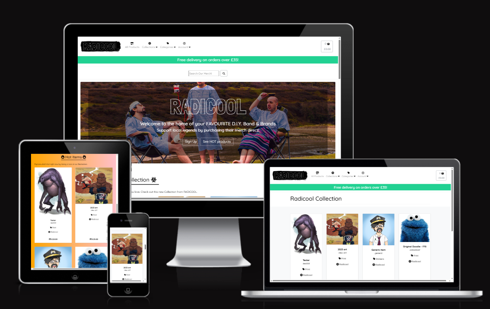

**RADICOOL - Home to your favourite D.I.Y. Bands & Brands**

---

**USER GOALS**

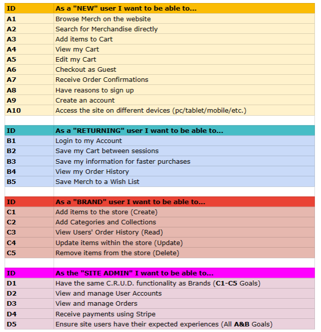

---

**SCHEMA**

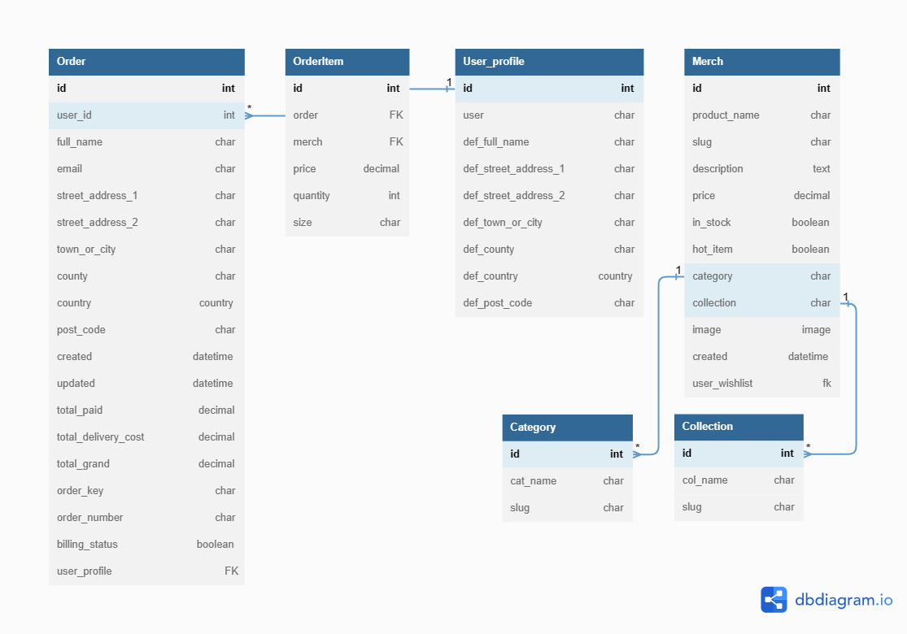

---

**Style Guide:**

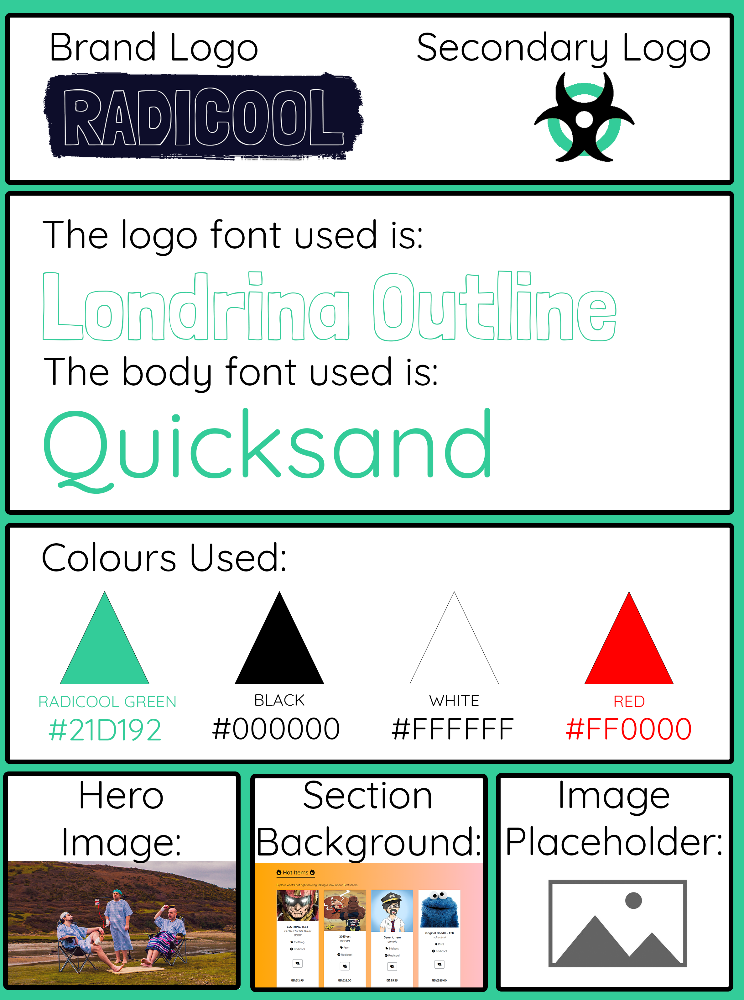

I put together a brand style guide to provide a visual representation of the websites core elements.

**Fonts used:**

[Quicksand - by Andrew Paglinawan:](https://fonts.google.com/specimen/Quicksand)

An easy to read "display sans serif" font with rounded corners. Designed to be legible at small sizes and used across nearly 2 million websites according to Googles API data. Used as a readable yet distinct main body font.

---

[Londrina Outline - by Marcelo Magalhães:](https://fonts.google.com/specimen/Londrina+Outline?preview.text=RADICOOL&preview.text_type=custom)

A font designed for use in posters, to be displayed in bold uppercase letters. Used as a reflection of the DIY style event and gig posters that would be seen and matches the culture and audience that RADICOOL seeks to serve. Used for the websites main logo.

---

**Colour Pallette used:**

**#21D192 - the main accent colour of the website.**

This green was chosen as it's an energetic, friendly and eye-catching colour. It compliments the websites minimal colour pallette of black and whites by allowing it to have a stronger brand identity.

This is also used to highlight icons and elements when the user hovers over them, providing positive feedback to user interactions.

---

**Red** was implemented very sparingly throughout the website as a means of highlight user interactions further. 

It is used when the user hovers over a "REMOVE FROM" wish list button specifically. The button uses an icon and hover text to indicate it's function to the user.
 
The red was chosen to give the "REMOVE" button further distinction from the "ADD" button, as the two share the same space and functionality.

This improves the users overall experience by providing the icon buttons pleasing UI with a different highlight to reinforce specific user actions.

---

**Black & White** were used to keep the website free from cluttering colour to allow the product imagery to stand out without having to compete with surrounding clashes.

They allow fonts, buttons and elements to remain readable and legible at any size.

They conform to and meet most user expectations, not giving them a reason to dislike the websites overall design or feel dissuaded from making a purchase.

It keeps the overall presentation inviting while allowing the accent green to take center stage across the website's elements.

---

**Brand Logo** 

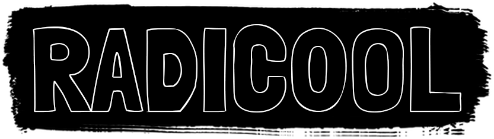

The logo makes use of **Londrina Outline** for the reasons described above.

It is displayed in white on top of a black paint brush stroke. This is to reinforce the **D.I.Y.** nature of the brand, it's ethos and it's customer base. 

It serves as a link back to the main home/index page of the website, something dictated by user expectations across nearly every website on the internet. 

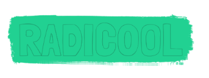

Upon `:hover` the logo changes to match the website's core green. Confirming that this is an interactable element to users.

[Isotropic](https://isotropic.co/tool/hex-color-to-css-filter/) was used to find the CSS filter information. This was used to create the above `:hover` effect.

---

**Favicon** 

The favicon used was the **"Toxic"** icon found on FontAwesome. 

It was edited to use the brand colours of Radicool.

The icon in particular was chosen to represent the **"RAD"** in **Radicool**, being a play on "**RAD**iation".

This would be present on proprietary merchandise that **RADICOOL** would sell directly through it's own website.

This is also utilised as the brands secondary logo & is present in browser tabs to provide a stronger brand identity.

---

**Hero Image**

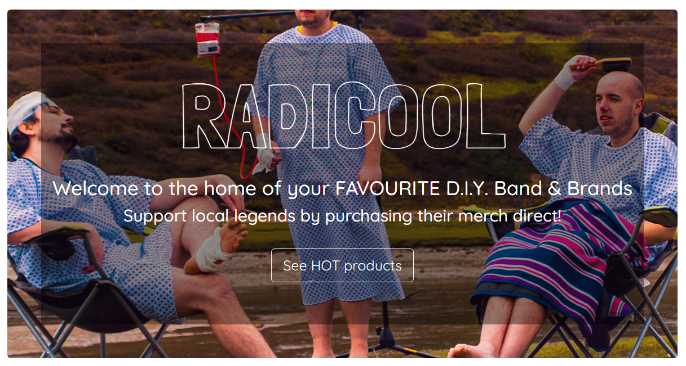

The section image currently in use is from the EP Cover **"D.O.A."** by **"The Oversights".**

They are a **D.I.Y.** band selling through Radicool. As this is a new release it is being used as the websites Hero Image, to further promote the band & provide an up-to-date example of a product for sale on the website.

This creates trust between sellers, the admin & the users looking to support the band, while also providing a visually interesting hero image for users on larger devices.

---

**Section Image**

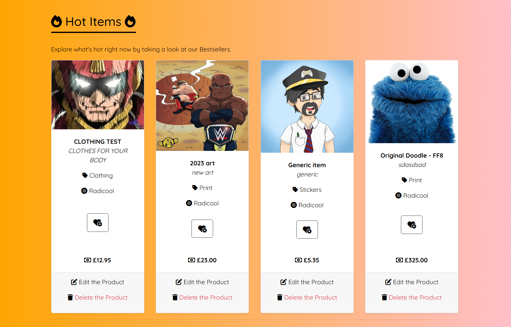

Following a similar premise to the user of the Hero Image, the "Hot Items" section is present on the home page.

This is the equivalent of a "Best Seller" or "Promoted collections" list. This is built as a section so that the filter query can be updated by the admin to display a different category/collection/list of items depending on what they are looking to promote at any given time.

To distinguish it from other collections present on the home page it has been given a distinct background. In this case a visually pleasing gradient has been used, including colours that indicate **heat** matching the idea of this particular collection.

This section is built with adaptability in mind, as the background is also easily changeable - through a single CSS line - to match the theme of the collection.
An image such as the above hero image, a different gradient, block colour or repeating pattern could all be implemented to compliment the theme.

This helps the section to stand out to a user while also increasing sales/click-throughs for both the band/brand.

---

**Featured Item Image**

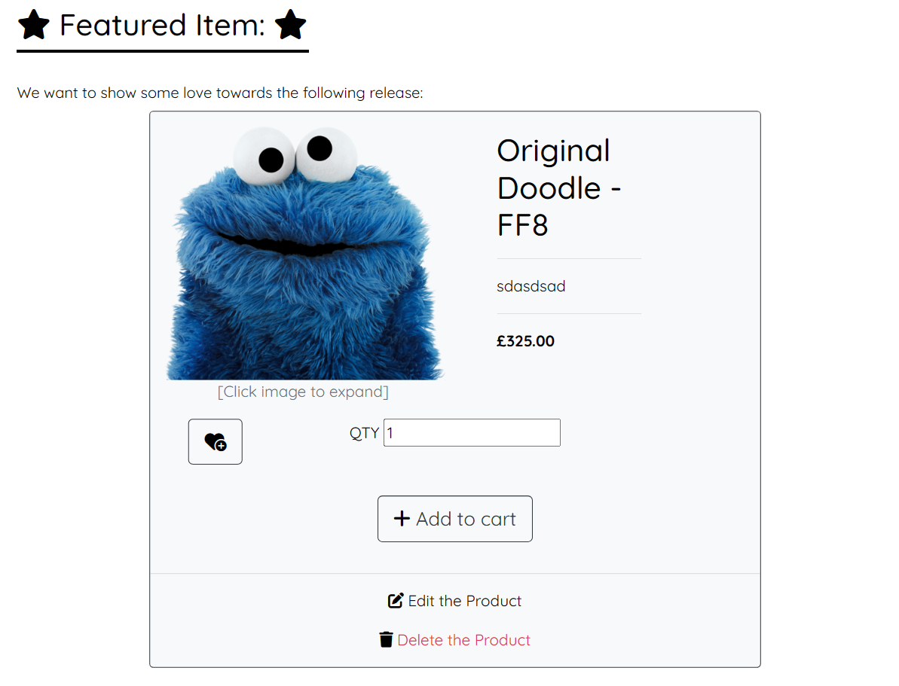

This follows the same reasoning and principles as the above two sections. 

The added benefit of a **Featured Item** is that this is the only item directly purchaseable* from the home page. Driving user interactions, wish list additions and sales for a specific item inline with site goals.

*(addable to cart) 

---

**Defensive Design**

Button Highlights - Icon colours being red, use of modals when logging out and deleting for admin users.

Image Placeholder if no Image provided ensuring something will always be present to the user and allow the admin to add products with imagery following.

Creation of the "Brand" user group. Edit/Delete buttons & a limited version of the Admin section (inline with user goals) are available to users with this assigned group. Allowing Brands and Bands to have their own accounts to add/remove merchandise, categories and collections, while also being able to view Order history.

Admin section full view only available to SuperUsers.

If a new user clicks a Wish List button they are redirected to sign-up/sign-in before being able to utilise the Wish List functionality of the site. Encouraging users to create an account.

---

**Interactive Design**

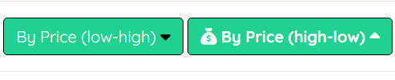

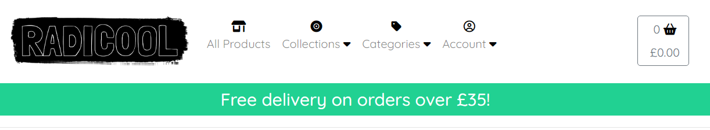

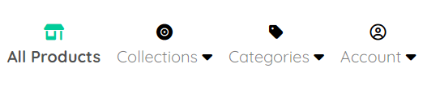

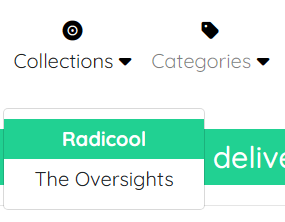

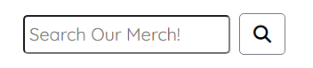

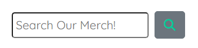

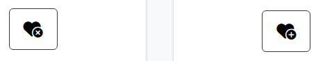

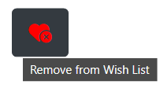

---

**Future Goals**

Implement deeper user groups limiting specific Brands to only be able to access their own relevant categories and collections to upload merchandise within. Protecting the rest of the website from interaction by unintended Brand users. Beyond the scope of the current project and not necessary for an initial launch where things will be small scale and directly under the control/supervision of the site Admin.

Add a subscription page to view live events from bands within a portal on the site, charging a monthly fee for access. Would be a good additional service to be offered but is again beyond the scope and implementation of the initial project.

Further payment options such as Paypal or Google Pay, not required by the assignment and would overcomplicate the checkout for the user while drawing attention away from the assignment-required Stripe payment section. 

**LINKS**

https://django-allauth.readthedocs.io/en/latest/views.html - Allauth Documentation
https://fontawesome.com/ - FontAwesome for Icons
https://learn.codeinstitute.net/ - For course videos & assignment
https://gist.github.com/qoomon/5dfcdf8eec66a051ecd85625518cfd13 - For guidance on Conventional Commits
https://dbdiagram.io/ - DB Schema Tool
https://docs.google.com/ - For user goals tables