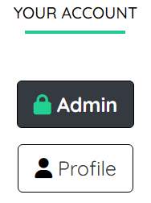
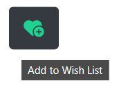

<div align="center">


# RADICOOL 
**Home to your favourite D.I.Y. Bands & Brands**

</div>

---

**Developer Links:**

*(Right-click to open in a new tab/window)*

[Developer - HK_Dev](https://github.com/Hadokane "Hadokane - Github")

[Commit Log](https://github.com/Hadokane/CCI_PP4_Radicool_Store/commits/main)

**Live Website Link:**

[Live Website - Heroku](https://radicool.herokuapp.com/ "Radicool")

**Repository Pages:**

[All HTML Templates](https://github.com/Hadokane/CCI_PP4_Radicool_Store/tree/main/templates)

[Repository page - Static Files](https://github.com/Hadokane/CCI_PP4_Radicool_Store/tree/main/static)

**Additional Documents**

[Testing Document - Automatic, Manual & User](TESTING.md)

---

# Academic Project Aims

This project was created to attain a **Diploma in Web App Development** from [Code Institute](https://codeinstitute.net/ "Code Institute").

The academic aim of this project is to design a Full Stack web application, offering multiple component apps, built using the Django framework.

As the site owner, I will achieve this by offering an E-commerce website named "Radicool." 

Targeted at music/alternative media fans, Radicool offers them a way to purchase merchandise from collections by D.I.Y. "Bands & Brands"* they love. (Referred to as "Brand Accounts" throughout this document.)

The above will be displayed throughout this project via my: coding, comments, commits, and the explanation provided by this README and the accompanying [TESTING](TESTING.md) document.

Full CRUD* functionality is achievable through the front end of the site, with different user groups having differing actions and interactions with site elements. *(Create, Read, Update, Delete.)

---

# Table of Contents

1. [User Experience (UX)](#user-experience---ux)
    - [Strategy Plane](#strategy-plane)
    - [Scope Plane](#scope-plane)
        - [Features Required](#features-required)
        - [Road Map](#road-map)
    - [Structure Plane](#structure-plane)
    - [Skeleton Plane](#skeleton-plane)
        - [Wireframes](#wireframes)
        - [Database Schema](#database-schema)
    - [Surface Plane](#surface-plane)
        - [Style Guide](#style-guide)
        - [Imagery](#imagery)
1. [Testing](#testing)
1. [Deployment](#deployment)
    - [Creating The Gitpod-Workspace](#creating-the-gitpod-workspace)
    - [Forking The Github Repository](#forking-the-github-repository)
    - [Deploying With Heroku](#deploying-with-heroku)
    - [Deploying With ElephantSQL](#deploying-with-elephantsql)
    - [Gitpod CLI Inputs](#gitpod-cli-terminal-inputs)
    - [PostgreSQL Inputs](#postgresql-inputs)
1. [Credits](#credits)
    - [Languages Used](#languages-used)
    - [Frameworks Libraries & Programs Used](#frameworks-libraries-and-programs-used)
    - [Validators Used](#validators-used)
    - [Technologies Used](#technologies-used)
    - [Imagery Used](#imagery-used)
    - [Acknowledgements](#acknowledgements)

---

# User Experience - UX

As has become tradition, I have chosen to arrange my UX analysis following the framework of Jesse James Garrett's philosophy of the "5 Planes," as discussed in his book [The Elements of User Experience](https://www.amazon.co.uk/Elements-User-Experience-User-Centered-Design/dp/0321683684/ref=asc_df_0321683684/?tag=googshopuk-21&linkCode=df0&hvadid=311000051962&hvpos=&hvnetw=g&hvrand=10376246921916888236&hvpone=&hvptwo=&hvqmt=&hvdev=c&hvdvcmdl=&hvlocint=&hvlocphy=1007448&hvtargid=pla-432330338546&psc=1&th=1&psc=1).

This methodology allows me to establish a clear, ordered and achievable list of goals for my project's development cycle while maintaining an organised development path. 

These goals will focus on meeting the needs of the website's users which include: First-time, Returning, Brand Accounts & the Site Owner.

By considering the needs of the aforementioned groups. I can develop a justified plan by establishing a defined priority of tasks and elements that will be required for site integration. This will ensure the project meets the defined user goals below & help to stop the project from being affected by "feature creep," at this early development stage.

---

# Strategy Plane

The below image displays the core established goals for Radicool's different user groups. These will influence the design decisions going forward and serve as the foundational decisions in designing this site.

In a later section, I will revisit these stories and see if/how the project has addressed each goal, justifying my explanations with imagery and proof cases.

Each subheading below provides these initial goal lists, with added explanations on where/how I expect to meet these goals throughout the development of the project.

---

## USER GOALS:

---


---

## Grid of Opportunities:

---

With the above goals in mind, I have assembled the following "Grid of Opportunities" to showcase the prioritised features heading into the next stage of development.

| Opportunity                        | IMPORTANCE | VIABILITY |
|------------------------------------|------------|-----------|
| All website elements function correctly    | 5          | 5         |
| Sign up & Login functions work correctly on any device     | 5          | 5         |
| Users have C.R.U.D. functionality over their basket and order     | 5          | 5         |
| Provide Admin functionality for the Site Admin         | 5          | 5         |
| Users can complete a purchase | 5          | 5        |
| User can view content by Category/Collection | 4          | 4        |
| Brand Accounts have C.R.U.D. functionality over merchandise     | 3          | 4         |
| Provide a wishlist page for users | 3          | 3        |

[Back to top ↑](#radicool)

---

# Scope Plane 

To set a clear scope for development and avoid "feature creep", I will establish the core features the website requires in this section, in doing so we will maintain an agile approach.

The features required are written concerning the established user group stories and directly reference how we can meet these stated goals with our site's design.

---

## Features Required:

---

**1. A Store App with an intuitive layout that meets user conventions and expectations.**

- Allows the user to browse the merchandise by Categories, Collections and additional means.

- Provide a search function for a more user-customisable approach to navigation.
    

**2. A Cart App to contain the user's order.**
    
- Navbar icon would allow users to see the quantity/total price of their Cart from any webpage/app on the site.

- Will allow the user C.R.U.D. functionality over their order before reaching the Checkout.

**3. A Checkout App to allow payments.**
    
- Provides a view of the cart. (READ)

- Allows users to save their checkout information to their profile for future convenience. (READ & UPDATE)

- Accepts Stripe payments for the Site Admin.

**4. A Profile App to allow users to VIEW data.**
    
- Provide a list of past orders. (VIEW)

- Allows users to save/update their checkout information. (READ & UPDATE)**

**5. A Users table within the Database to store each user's account information.**
    
- Allows sign up/sign in/sign out functionality throughout the site.

- Allows the Admin C.R.U.D. functionality over user data.

**6. An Admin/Superuser section.**

- Allows the Admin C.R.U.D. functionality over site data.

- Allows the creation of a "Brand Accounts" group. Can be shown specific front-end pages allowing C.R.U.D. actions like adding, editing or deleting Merchandise, Categories & Collections without accessing the Admin section.

**7. Provide a positive user experience through site elements.**

- Including Alerts/Toasts to confirm user actions (such as login/wishlist update.) 
    
- Buttons, links & form inputs changing colour on `:hover` to show user interaction is possible.

- Cards increasing in size on `:hover` to show the user is interacting with it.  

[Back to top ↑](#radicool)

---

## Road Map

---

By establishing the features needed to meet our current user stories, I can now create a Road-Map for hypothetical future updates that would serve to improve the overall features, functions or user experience of this project and its apps. 

These updates have been deemed non-essential for an initial "proof-of-concept" build and would simply serve to enhance the core website that is being prioritised at this early stage of development.


### Future goals:

---

In a theoretical "next update", I would aim to add additional functionality to the website and provide a further distinction between Brand Accounts looking to sell their merchandise through Radicool.

**To improve the experience for the user, the following could be implemented:**

1. Provide additional payment options such as Paypal or Google Pay to the checkout. Stripe was required specifically by the project's Assessment Criteria and as such serves as the current implemented payment method. In a live setting including Paypal or Google Pay would be a preference as I feel these are more widely known to the standard consumer and would improve user confidence in shopping with Radicool.


**To improve the experience for Bran Accounts, the following could be implemented:**

1. Create specific user groups for each Brand Account that sells through Radicool. Limiting their C.R.U.D. functionality to predefined Categories & Collections within the website. This is in the interest of defensive design as it would stop Brand Accounts from being able to add, edit or delete another Brand Account's Merchandise. Currently, this isn't a priority or issue as all Brand Accounts are fictional and their merchandise could also be uploaded/managed by the Site Admin directly at this current stage. This would be beneficial given the small scale of the current site, limiting the need for multiple Brand Account Groups being created via Django.

2. Allow Brand Accounts to see how much stock of their Merchandise has been purchased through their Admin page. Could set up direct emails to them each time one of their items sells. Currently, they would need to scan through Order History manually or trust the Site Admins' reports to see how well their Merchandise was selling. This wasn't deemed a priority feature for an initial launch as it doesn't affect the site functionality or initial User Goals established.

**Further Features**

1. Add a subscription page to view live events from Bands within a portal on the site. Would match the ethos and provide a unique ISP for Radicool, driving user sign-up and converting into an increase in Merchandise sales. This would be a good, fit-for-culture, additional service that could be offered but is again beyond the scope and implementation of this initial project.

[Back to top ↑](#radicool)

---

# Structure Plane:

With the user stories and scope of our project established, we will now decide upon the priority of features. 

---

## Feature Priority

The below sections will lay out what each page and app of this website will provide the user in terms of features, interactions and content. It allows us, as the developer, to have a concrete list of what to include on a page-by-page basis.


### Base Template

---

A `base` HTML template will be created to provide core features and elements. It will utilise the Django templating language to be inherited widely by all other pages on the website. This ensures a D.R.Y. approach to design, allowing us to create elements such as the Navbar and Footer in one HTML file, rather than copying the code to each page.

It will feature:

- Links to external CSS & Javascript files such as [Bootstrap](https://getbootstrap.com/) and [FontAwesome](https://fontawesome.com/). 

- Links to Django Static & Media files, as well as any required internal CSS & Javascript.

- A responsive navigation menu, utilising Bootstrap classes. 

    - All users will be able to browse the website's Merchandise pages, arranged by factors such as Category or Collection.

    - Unauthenticated/New users will have access to links to `Sign up` and `Login`.
    
    - Authenticated users (logged-in) will have access to the `Profile` and `Wishlist` pages, along with an option to `Logout`.
        
        - The `Logout` button will call a modal, providing defensive design to address accidental user interactions.

    - Brand Accounts will see an additional link to the `Admin` and `Add Merch` sections.

    - The navbar will be responsive and collapse on smaller devices into a user-friendly "burger icon" menu.

    - Provide a `Cart` icon to show users their current `Subtotal` & `Quantity` of items within the cart.

- A notification banner to display current offers or promote new collections.

- A section to display toasts/messages to the user, providing positive feedback to site interactions.

- Under the above sections would be a Django `` tag, where we will insert other page's content, keeping a uniform, D.R.Y.-designed E-commerce store.

- A clean Bootstrap Footer containing:

    - Placeholder social links, that could be swapped out to represent Radicool's social media presence.

    - A short "about" blurb and contact info.

    - Unauthenticated/New users will see links to `Sign up` and `Login`.

    - Authenticated users will see a link to access their `Profile`.

    - Brand Accounts will see an additional link to the `Admin` section.
    
    - A copyright disclaimer.

---

## Store App

---

The following pages would be contained within a Django "Store" app, created to house all pages concerning Merchandise.

- All of the below pages will feature a Django "include" in the form of a `Search Bar`.

    - This is deemed unnecessary on other website apps as it pertains directly to the users viewing Merchandise, meaning it would clutter other sections.

    - It will allow users to search Merchandise items by checking the database to see if the "Searched Term" appears anywhere within an item's `product_name` or `description`. 

    - If a match is made, it will return the data in the form of Bootstrap cards.

    - If no match is made, users will be informed & prompted to search again.

- For Brand Users and the Site Admin, options will appear on all Bootstrap item cards - within a footer - providing them with the ability to delete or edit the specific product featured within the card. 

    - This allows them the freedom to edit/delete Merchandise from within the website's Front-End, saving them from heading into the Admin section.

- Wish List buttons will appear for all users, interacting with the button will have a different function based on the user's state:

    - Unauthenticated users will be redirected to the `Sign Up` page.

    - Authenticated users without the item on their wishlist will see a Green `Add to Wish List` button.

    - Authenticated users with the item on their wishlist will see a Red `Remove from Wish List` button.


### Home Page

---

The first thing the user should be greeted by is an appealing `Home Page/Index` containing the following:

- A clutter-free, intuitive design, making use of Bootstrap classes and minimal brand colours to allow Merchandise imagery to stand out.

- A large hero image to promote an important collection to users - such as a new release from one of the website's Brand Accounts.

    - Containing brand text & a button to send `New Users` to the `Sign Up` page or promote a Collection to `Returning Users`.

- Sections containing rows of promo cards, styled with Bootstrap. 
    
    - These will house each Merchandise item for sale and can be arranged into sections based on Brand Account, Category, Collection or something different entirely such as "Hot Items," which can be used to promote Best Sellers or a hand-picked selection differing from the pre-defined methods.

    - Individual sections will have different headers and icons used to refer to their collections.

    - Sections may include a background image or colour to make it more distinct to users, encouraging interaction.

- A `Featured Item` card. Similar to the above but being the only Merchandise item directly buyable through the Home page. Serving as a boon for Brand Accounts whose items are chosen and encouraging user views and purchases.

    - Requires `add to cart` functionality through Javascript & AJAX requests to update the Navbar Cart icon in real-time.

- A row of icons and informative text pertaining to Radicool's core values and practices. Inspiring confidence in users looking to shop with us.


### Products Page

---

- Displays all Merchandise in a single Bootstrap Row, utilising responsive column classes based on the device screen size.

- Contains a secondary navbar, that responsively collapses on smaller screens.

    - Allows organising of the Merchandise by factors such as Name (A-Z), (Z-A); Price (Low-High), (High-Low); Category; Collection; etc.


### Category & Collection Pages

---

- Displays a filtered Merchandise list. Only showing the Merchandise included within the given Category or Collection.

    - Beneficial to Brand Accounts as a Brand can have its own dedicated Merchandise page through the use of a Collection.

    - Beneficial to Users by giving them options like CD, VINYL or PRINT to find the Merchandise they're interested in.


### Info Page

---

- Provides the user with the same functionality as the `Featured Item` on the homepage.

- Serves as the user's interaction point for `Adding` an item to the Cart.

- Interacting with the Merchandise image will open it in a separate browser tab for users to view in closer detail.

[Back to top ↑](#radicool)

---

## Cart App

---

The Cart App will contain a single HTML page, displaying the contents of the cart to the user.

It will provide:

- If the cart is empty, it will notify the user and provide a button to take them to the `Products` page.

- Show a live updating subtotal, delivery cost & grand total for the current sessions cart.

- If the user has cart contents, provide a button to take them through to the `Checkout`.

- Users with CRUD functionality allowing them to edit Merchandise: Quantity and Size (if Clothing).

    - Required Javascript for the above functions & AJAX to update the values (quantity, size, subtotal, cart_quantity, etc.) in real-time.

---

## Checkout App

---

The Checkout App will contain two HTML pages. 

- The checkout page will:

    - Display the Cart contents in a Read-only section. CRUD functionality takes place on the cart app for this, but showing it again provides a helpful confirmation of what the user is purchasing, allowing them to return to the cart app to make changes before purchasing.

    - Provide the user with a form - utilising [Django Crispy Forms](https://django-crispy-forms.readthedocs.io/) - to enter their delivery information.

    - Provide a checkbox, allowing the user to save their delivery information to their profile, improving their experience dramatically on subsequent purchases and meeting expectations.

    - Provide a Stripe payment element. Allowing the user to submit payments & the Site Admin to receive payments.

- The success page will: 

    - Confirm the user's order has been made. Providing positive feedback and confirmation of a Successful order.

    - Show their order & delivery information.

---

## Profiles App

---

The Profiles App will contain two HTML pages. 

- The Profile page will:

    - Allow the user to Read, Add or Edit their saved delivery information for faster purchases and convenience.

    - View any former orders and see their information by interacting with them.

    - Greet the user by their username to provide a positive experience and create a more personable page.

- The Wish List page will: 

    - Display any items the user has added to their Wish List while browsing the website.

    - Serve as a direct link to return to that item's `Info` page, allowing them to add it to their carts.

    - Allow the user to remove the item by interacting with them.

    - Provide users with a further incentive to sign up for a Radicool account.

---

## Sign Up & Login Pages

---

Account pages will be handled through the use of Django `AllAuth` which serves as a convenient framework within Django for managing user accounts. 

- The AllAuth HTML templates will be modified via CSS and templating to match the website's overall look and style.

- Django Crispy Forms will be utilised for consistency.

- These pages will provide users with the following features and pages: 
    
    - For the sign-up process: sign up, verification email required, email confirmation.
    
    - For users: login, logout, password resetting.

- These provide expected user conventions and experiences as AllAuth is utilised across numerous popular websites internet wide, lending a further sense of credibility and confidence to users looking to purchase Merchandise through Radicool.

---

## Superusers App

---

This app will include two pages only viewable to superusers/Site Admin and Brand Accounts.

They will allow users to add new or edit existing Merchandise through the website's Front-End. Providing a convenient method of C.R.U.D. functionality, improving the Radicool experience for Brand Accounts.

They will both utilise Django Crispy Forms to display the required form fields to the user, providing helpful text to aid them in completing the form.

Upon submission, the Merchandise will be immediately available for purchase on the website.

[Back to top ↑](#radicool)

---

## The interaction design (IXD)

---

**Buttons**

1. Will use built-in Bootstrap classes to remain consistent across the website.

2. On`:hover` the text and icons present will bolden or change colour to indicate interactions can occur.

3. A combination of contextual icons and text will be used to convey the purpose of the button to users.

4. Will be coloured clear if related to navigation or site features.

5. Will be coloured green if related to sorting of Merchandise. The user can create an expectation based on the appearance of the button.

**Merchandise Cards**

1. Bootstrap classes will be used for consistency and convenience.

2. Images will be present in the card header and serve as a link to an `info` page for the specific item.

3. Merchandise names will be interactable and lead to the `info` page.

4. Category and Collection names will be interactable and lead to their specific pages.

5. A footer will appear to superusers allowing them to Edit or Delete the item.

**Alerts**

1. Will be colour-coded to match user expectations.
    
    - Green will be used for successful interactions such as adding an item to the wishlist.

    - Red will be used to draw the user's attention to any warnings or issues preventing their intended goal.

2. `onClick` these elements will be removed from view.


**Overall the Radicool website will:**

- Be consistent in design, branding and colours used throughout.

- Provide visual feedback on user actions, both positive and negative.

- Allow the user to create an account and sign in/log out with ease.

- Allow the user to Create/Read/Update/Delete functionality as specified in the above sections.

- Allow the user to assemble a Wish List of Merchandise, ready for a future purchase.

- Be readable and legible on all devices.

- Utilise a Relational Database Management System in the form of PostgreSQL to store and retrieve necessary data.

[Back to top ↑](#radicool)

---

# Skeleton Plane

Radicool will be created entirely with HTML, CSS, Javascript & Python languages.

The website will present numerous opportunities for different user groups to carry out C.R.U.D. functionality at their discretion.

All of the website's data will be housed within a [PostgreSQL](https://www.postgresql.org/) `Relational Database System`, which will be used to store the created user data in organised tables.

Utilising one-to-many relationships and Foreign Keys, these tables will communicate with each other and as such we will be able to maintain relationships such as: associating orders with the user who placed them or seeing which Merchandise belongs to which Category or Collection.

Django utilises [sqlite](https://www.sqlite.org/index.html) - which is included in Python - as a database engine, this will be utilised throughout the project in the creation and maintenance of all local databases before hosting their content externally for deployment.

The production databases are hosted externally on [Railway](https://railway.app/) so that they are accessible to [Heroku](https://dashboard.heroku.com/), our hosting platform of choice for this project.

---

## Wireframes

---

The below wireframes - created with [Draw io](https://www.draw.io) - demonstrate the positions of features and elements within the site's many apps and pages, providing a simplified visual demonstration of the project's architecture and design choices.

<details><summary>Radicool Wireframe</summary></details>

---

## Database Schema

---

A database schema was created to provide a visual representation of the tables and key pairs necessary for this project to function.

<details><summary>Database Schema</summary></details>

Below is a screenshot of all the databases present within Railway. The additional tables - to the ones shown above - were created automatically by Django AllAuth to carry out its functionality and store data created during User Sign Up actions.

<details><summary>Railway Databases</summary></details>

[Back to top ↑](#radicool)

---

# Surface Plane

This final UX section will tie together the above goals and features by describing how a positive experience is created for users through the use of hover effects, predictable navigation, descriptive alerts, clear content and overall design choices and philosophies that were reached by following the prior planes.

---

## Responsive Design

---

As a software developer, I am fully aware that Radicool will be viewed across numerous different browsers, screen sizes and device types. As such, responsive design becomes a crucial factor in ensuring Radicool is accessible to as many users as possible across their multitudes of devices.

*Manual testing will also be implemented and detailed in the TESTING document, further ensuring elements display as expected. 

Bootstrap classes were used extensively across the website, as a reliable, industry-standard solution in achieving responsive design. Their container classes and cards can be seen across all areas of the website. 

Additional custom CSS was utilised to ensure all images, elements and text will display comfortably on multiple devices, ensuring a consistent user experience for both mobile and desktop users.

Examples of the website meeting responsive design conformities are shown here:

- The sort bar on the `Products` page collapses on medium or smaller screens - as designated by Bootstrap - to stop the bar from condensing into two or more lines, making it difficult for the user to interact with the correct button.*

- Card rows change in size responsively to the screen size. *(Cards & Sort Bar visible together in card examples.)

    - <details><summary>Cards - Small</summary></details>

    - <details><summary>Cards - Medium</summary></details>

    - <details><summary>Cards - Large</summary></details>

- The navigation bar collapses on smaller devices to ensure all page links are accessible to the user without ruining the overall site design.
    
    - <details><summary>Large Screen Navigation Bar</summary></details>

    - <details><summary>Small Screen Navigation Bar - Collapsed</summary></details>

    - <details><summary>Small Screen Navigation Bar - Open</summary></details>

- Pages with two or more columns move above or beneath each other when the page size shrinks by utilising Bootstrap row and column classes.
    
    - <details><summary>Standard view</summary></details>

    - <details><summary>Mobile view</summary></details>

[Back to top ↑](#radicool)

---

## Style Guide:

Utilising [Photoshop](https://www.adobe.com/uk/products/photoshop.html) I assembled a brand style guide to provide a visual representation of the website's core elements, typography and imagery.

<details><summary>Style Guide</summary></details>

---

### Fonts / Typography:

---

[Quicksand - by Andrew Paglinawan:](https://fonts.google.com/specimen/Quicksand)

An easy-to-read "display sans serif" font with rounded corners. Designed to be legible at small sizes and used across nearly 2 million websites according to Google's API data. Used as a readable yet distinct main body font.

---

[Londrina Outline - by Marcelo Magalhães:](https://fonts.google.com/specimen/Londrina+Outline?preview.text=RADICOOL&preview.text_type=custom)

A font designed for use in posters, to be displayed in bold uppercase letters. Used as a reflection of the DIY style event and gig posters that would be seen and matches the culture and audience that RADICOOL seeks to serve. Used for the website's main logo.

---

### Colour Palette:

---


**#21D192 - the main accent colour of the website.**

This green was chosen as it's an energetic, friendly and eye-catching colour. It complements the website's minimal colour palette of black and white by allowing it to have a sole colour to define its brand identity.

This is also used to highlight icons and elements when the user hovers over them, providing positive feedback to user interactions.

---

**Red** was implemented very sparingly throughout the website as a means of highlighting user interactions further. 

It is used when the user hovers over a "REMOVE FROM" wish list button specifically. The button uses an icon and hover text to indicate its function to the user.
 
The red was chosen to give the "REMOVE" button further distinction from the "ADD" button, as the two share the same space and functionality.

This improves the user's overall experience by providing the icon buttons pleasing UI with a different highlight to reinforce specific user actions.

---

**Black & White** were used to keep the website free from cluttering colour to allow the product imagery to stand out without having to compete with surrounding clashes.

They allow fonts, buttons and elements to remain readable and legible at any size.

They conform to and meet most user expectations, not giving them a reason to dislike the website's overall design or feel dissuaded from making a purchase.

It keeps the overall presentation inviting while allowing the accent green to take centre stage across the website's elements.

[Back to top ↑](#radicool)

---

### Visual Separation

The website follows a traditionally ordered hierarchy and achieves visual separation through the use of Bootstrap `Row and Columns`. 

At the top, there is a responsive `Header`, containing a navbar with links to all of the website's HTML pages.

Underneath this is an "update" banner, providing deal information to customers.

Next alert messages will display when called by user actions. These are closable `onClick`.

The specific HTML page content is then displayed through the use of Django  tags here. Being made up of interactable elements allowing the user to navigate, purchase merchandise or perform CRUD functionality where relevant such as editing their Wish List.

Finally a `Footer` with placeholder links, a short site blurb and a copyright disclaimer.

This simple layout allows a user to intuitively navigate Radicool with no learning curve, as it meets the same standard conventions as the majority of popular websites and as such users should be able to navigate it with ease. This will be further reinforced by manual and automated testing criteria in the TESTING document. 

---

## Imagery

---

### Brand Logo 

---


The logo makes use of **Londrina Outline** for the reasons described above.

It is displayed in white on top of a black paint brush stroke. This is to reinforce the **D.I.Y.** nature of the brand, its ethos and its customer base. 

It serves as a link back to the main home/index page of the website, something dictated by user expectations across nearly every website on the internet. 


Upon `:hover` the logo changes to match the website's core green. Confirming that this is an interactable element for users.

[Isotropic](https://isotropic.co/tool/hex-color-to-css-filter/) was used to find the CSS filter information. This was used to create the above `:hover` effect.

---

### Favicon 

---


The favicon used was the **"Toxic"** icon found on FontAwesome. 

It was edited to use the brand colours of Radicool.

The icon, in particular, was chosen to represent the **"RAD"** in **Radicool**, being a play on "**RAD**iation".

This would be present on proprietary merchandise that **RADICOOL** would sell directly through its website.

This is also utilised as the brand's secondary logo & is present in browser tabs to provide a stronger brand identity.

---

### Hero Image

---

<details><summary>Hero Image</summary></details>

The section image currently in use is from the EP Cover **"D.O.A."** by **"The Oversights".**

They are a **D.I.Y.** band selling through Radicool. As this is a new release it is being used as the website's Hero Image, to further promote the band & provide an up-to-date example of a product for sale on the website.

This creates trust between sellers, the admin & the users looking to support the band, while also providing a visually interesting hero image for users on larger devices.

---

### Section Image

---

<details><summary>Section Image</summary></details>

Following a similar premise to the user of the Hero Image, the "Hot Items" section is present on the home page.

This is the equivalent of a "Best Seller" or "Promoted collections" list. This is built as a section so that the filter query can be updated by the admin to display a different category/collection/list of items depending on what they are looking to promote at any given time.

To distinguish it from other collections present on the home page it has been given a distinct background. In this case, a visually pleasing gradient has been used, including colours that indicate **heat** matching the idea of this particular collection.

This section is built with adaptability in mind, as the background is also easily changeable - through a single CSS line - to match the theme of the collection.
An image such as the above hero image, a different gradient, block colour or repeating pattern could all be implemented to complement the theme.

This helps the section to stand out to a user while also increasing sales/click-throughs for both the band/brand.

---

### Featured Item Image

---

<details><summary>Featured Item</summary></details>

This follows the same reasoning and principles as the above two sections. 

The added benefit of a **Featured Item** is that this is the only item directly purchasable* from the home page. Driving user interactions, wish list additions and sales for a specific item in line with site goals. Improving interactions for the user and driving sales for Brand Accounts.

*(addable to cart) 

[Back to top ↑](#radicool)

---

## IXD - Interaction Design
---

IXD was described during the above Skeleton Plane. Below is imagery confirming visual examples of the aforementioned points, serving as confirmation of their inclusion within the final design.

I have included images below to provide visual examples of each point and to serve as confirmation that these decisions have been implemented into the final designs. Demonstrations of `:hover` interactions, icon and colour changes along with custom CSS usage are demonstrated below to provide positive user interactions throughout the multiple apps and elements that comprise Radicool.

**Buttons**

<details><summary>Account Button :hover example</summary></details>

<details><summary>Sort Bar :hover example</summary></details>

<details><summary>Wish List Buttons example</summary></details>

<details><summary>Add to Wish List :hover example</summary></details>

<details><summary>Remove from Wish List :hover example</summary></details>


---

**Navigation Menu Examples**

<details><summary>Standard Nav Bar</summary></details>

<details><summary>Nav Bar :hover example</summary></details>

<details><summary>Nav Bar dropdown :hover example</summary></details>

---

**Search Bar Example**

<details><summary>Standard Search Bar</summary></details>

<details><summary>Search Bar :hover example </summary></details>

---

**Merchandise Cards**

<details><summary>Cards Example</summary></details>

---

**Alerts**

<details><summary>Alert Positive Example</summary></details>

<details><summary>Alert Negative Example</summary></details>

---

### Defensive Design

---

Examples of defensive design implementations can be seen here:

- The delete button required a failsafe to prevent Brand Accounts from unintentionally removing Merchandise. This was achieved through the use of a Bootstrap modal. Upon clicking the delete link on a card, the modal loads, making users confirm their actions, improving their overall experience and providing a defensive design solution to this issue.

    - <details><summary>Delete Modal</summary></details>

- The above method was also implemented on the `logout` page of the website. Moving this page inside of a modal provides the same defensive solution and improvements to user experience as mentioned above, also shortening the user's journey by eliminating the need for a separate HTML `logout` page.

    - <details><summary>Delete Modal</summary></details>

- Button`:hover` icons change colour to indicate a positive (Green) or negative (Red) user action, providing positive visual feedback. In the following IXD section, look at the `wish list buttons` images to see a clear example of this design principle. Red indicates `Remove` and Green represents `Add`.

- A `Placeholder Image` is applied to Merchandise by default if no Image is provided by the user, ensuring something will always be present on the Front-End, allowing the Admin to `Add` Merchandise without imagery.

- Through the creation of a "Brand" user group in Django. 

    - Providing Edit/Delete buttons on the website's Front-End Merchandise for CRUD functionality.

    - Access to designated Add/Edit Merchandise pages on the Front-End.

    - Access to a customised Admin section, in line with the established Brand Account goals.

        - Allowing Brand Accounts to add/remove Merchandise, Categories & Collections. 
        
        - Allows Brand Accounts to view Order History.

Admin section full view only available to SuperUsers.

If a new user clicks a Wish List button they are redirected to sign-up/sign-in before being able to utilise the Wish List functionality of the site. Encouraging users to create an account.

[Back to top ↑](#radicool)

---

# Testing

**[--> Please refer to the separate Testing document located here <--](TESTING.md)**

**Clicking the above link will open "TESTING.MD"*

**This document contains information on the following:**
- Website Validation 
- Manual & Automated Testing of code & features 
- Device Testing
- Testing established user stories
- Confirmation of user stories & site goals
- Bug Reports

[Back to top ↑](#radicool)

---

# Deployment

## Creating the Gitpod Workspace

The project uses the Code Institute Gitpod Template as its foundation. 

This can be accessed by doing the following:

1. Log in to your GitHub account. 
2. Head to the [Code Institute Student Template](https://github.com/Code-Institute-Org/gitpod-full-template).
2. Click 'Use this Template' next to the Green Gitpod button.
3. Click the "Use this template" button.
4. In the dropdown menu select "Create a new repository".
5. You will be presented with the example screen below.
6. Enter your details & press "Create repository from template"

    <details><summary>Create Repository Example</summary></details>

---

## Forking the GitHub Repository

If you would like to fork this GitHub Repository - make a copy of the original on your GitHub account - do the following:

1. Log in to your GitHub account.
2. Head to the [Radicool GitHub Repository](https://github.com/Hadokane/CCI_PP4_Radicool_Store).
3. Select the "Fork" tab on the right-hand side of the navigation menu.
4. Choose a destination to save your newly forked repository.
5. Press Create Fork.

    <details><summary>Fork Example</summary></details>

For further information on making a local clone of this project, I recommend reading the GitHub Docs guide on forking located [here.](https://docs.github.com/en/github-ae@latest/get-started/quickstart/fork-a-repo)

---

## Deploying with Heroku

The application was then deployed with Heroku using the following steps:

1. Create an account / Login to [Heroku](https://dashboard.heroku.com/apps).
2. On the main page select the "New" button and chose "Create new app".

    <details><summary>Heroku Button</summary></details>

3. Enter a unique name for your project (with no spaces or capitalisation) and select your closest region (Europe in my case).
4. Select the 'Create App' button.

    <details><summary>Heroku Create App</summary></details>

5. Install Heroku into the project by entering ```npm install -g heroku``` into the terminal.
6. Enter ```heroku login -i``` into the terminal and enter your heroku credentials. 
    - If you have two-factor authentication enabled use a Heroku API key instead of your password when connecting to Heroku via CLI. This can be found on your Heroku "manage account" page.
7. Enter ```heroku apps``` in the GitHub Terminal to see a list of your created apps & confirm your created app exists.
8. Head to the Heroku dashboard "settings" tab for your created project and find the "Heroku git URL" shown there.
9. Copy that URL and paste the following into the GitHub CLI Terminal: ```git remote add heroku your_url``` (replacing your_url with the "Heroku git URL" mentioned above.)
12. Use ```git push -u heroku main``` to push the main branch of the project to heroku. (Will fail if the "Procfile" or "requirements.txt" are missing from your project.)
13. Finally enter the following into the "Config Vars" section found on the Heroku Dashboards "Setting" tab. Select the "Reveal Config Vars" button and enter the following information for the keys, followed by your values for the database and external apps like Stripe and Amazon AWS services.

    <details><summary>Heroku Config Example</summary></details>

| Key                   | Value                      |
|-----------------------|----------------------------|
| AWS_ACCESS_KEY_ID     | Your AWS Access Key        |
| AWS_SECRET_ACCESS_KEY | Your AWS Secret Access Key |
| DATABASE_URL          | Your Database URL          |
| EMAIL_HOST_PASS       | Your Email Password        |
| EMAIL_HOST_USER       | Your Email Address         |
| SECRET_KEY            | Your Secret Key            |
| STRIPE_PUBLIC_KEY     | Your Stripe Public Key     |
| STRIPE_SECRET_KEY     | Your Stripe Secret Key     |
| STRIPE_WH_SECRET      | Your Stripe WH Key         |
| USE_AWS               | TRUE                       |


12. Press "Open app" on Heroku. 

13. Breathe a sigh of relief, the app is deployed, live and operational!

    <details><summary>Heroku Example Screen</summary></details>

This step won't be necessary if you've cloned the project as the files are already created and readily available, however, you will need to update the "requirements.txt" file if you install additional frameworks or dependencies to your version of this project so I will include the methods used to create the file below.

1. Create a new "requirements.txt" file by typing ``` pip3 freeze --local > requirements.txt ``` into the Gitpod Command Line Interface Terminal & commit it to GitHub.

---

## Deploying with Railway

Due to uncertainty in Heroku, the PostgreSQL database is hosted externally on Railway.

1. Navigate to and create an account with [Railway](https://railway.app/) and click “Start a New Project.”

    <details><summary>Railway</summary></details>

2. Chose "Provision PostgreSQL" from the dropdown list.

    <details><summary>Railway #2</summary></details>

3. Select the new database and go to the "Connect" tab. Here you will see your "Postgres Connection URL". (Example screens from a fake project.)

    <details><summary>Railway #3</summary></details>

4. This will be used in Heroku as our "DATABASE_URL" Key: Value pair. You can add it to your Config Vars by navigating to Heroku's Settings page for your project.

5. In your Django project head to the settings.py file and change the database engine string from `sqlite3` to `postgresql` as shown below.

```
DATABASES = {
    'default': {
        'ENGINE': 'django.db.backends.postgresql',
        'NAME': '<PGDATABASE>',
        'USER': '<PGUSER>',
        'PASSWORD': '<PGPASSWORD>',
        'HOST': '<PGHOST>',
        'PORT': '<PGPORT>',
    }
}
```

6. Using the above format, input your "available variables" from Railway's "Connect" tab to fill in the `NAME, USER, PASSWORD, HOST` & `PORT` settings.

7. Run `python3 manage.py migrate` and the project data will populate the Postgres database on Railway.

[For further information I recommend this informative article from Youtuber Dennis Ivy](https://dev.to/dennisivy11/easiest-django-postgres-connection-ever-with-railway-11h6).

---

## Amazon Web Services (AWS):

Static and Media files for the deployed site are hosted within an AWS S3 bucket.

1. Follow the information on creating an S3 bucket in the
[AWS Docs - Click Here.](https://docs.aws.amazon.com/AmazonS3/latest/userguide/creating-bucket.html)

2. Install boto3 and django-storages within Gitpod using the following CLI terminal commands:

```
$ pip3 install boto3
$ pip3 install django-storages
```

3. Add 'storages' to INSTALLED_APPS in settings.py.
4. Add the following code to settings.py to link the AWS bucket to your website:

```
if 'USE_AWS' in os.environ:
    # Cache control
    AWS_S3_OBJECT_PARAMETERS = {
        'Expires': 'Thu, 31 Dec 2099 20:00:00 GMT',
        'CacheControl': 'max-age=94608000',
    }

    # Bucket Config
    AWS_STORAGE_BUCKET_NAME = 'your-project-name-here'
    AWS_S3_REGION_NAME = 'your-aws-region-here-for-me-it-was-(eu-west-1)'
    AWS_ACCESS_KEY_ID = os.environ.get('AWS_ACCESS_KEY_ID')
    AWS_SECRET_ACCESS_KEY = os.environ.get('AWS_SECRET_ACCESS_KEY')
    AWS_S3_CUSTOM_DOMAIN = f'{AWS_STORAGE_BUCKET_NAME}.s3.amazonaws.com'

    # Static and media files
    STATICFILES_STORAGE = 'custom_storages.StaticStorage'
    STATICFILES_LOCATION = 'static'
    DEFAULT_FILE_STORAGE = 'custom_storages.MediaStorage'
    MEDIAFILES_LOCATION = 'media'

    # Override static and media URLs in production
    STATIC_URL = f'https://{AWS_S3_CUSTOM_DOMAIN}/{STATICFILES_LOCATION}/'
    MEDIA_URL = f'https://{AWS_S3_CUSTOM_DOMAIN}/{MEDIAFILES_LOCATION}/'
```

5. Push these changes to Heroku.

---

# Credits 

## Languages Used:

- HTML 5
- CSS 3
- Javascript ES2022
- Python 3

--- 

## Frameworks Libraries and Programs Used:

- [Heroku](https://heroku.com/)
  - Heroku is used for the deployment & hosting of this project.

- [ElephantSQL](https://elephantSQL.com)
  - For hosting the PostgreSQL database for Heroku to access.

- [PostgreSQL](https://www.postgresql.org/)
    - Was utilised as my Relational Database Management System of choice during the project.

- [Django](https://www.djangoproject.com/)
  - Python library utilised as the main framework for creating this E-Commerce store.
  - Additional Django Framework includes:
    - [Admin](https://docs.djangoproject.com/en/4.2/ref/contrib/admin/) - Provides Admin interface.
    - [Allauth](https://django-allauth.readthedocs.io/en/latest/) - Handles user authentication and account management.
    - [Crispy Forms](https://django-crispy-forms.readthedocs.io/en/latest/) - Handles form templates.
    - [Countries](https://pypi.org/project/django-countries/) - Handles the Country field for the Order model.
  
- [Pillow](https://pypi.org/project/Pillow/)
    - Adds image processing to Python.

- [SQLite3](https://www.sqlite.org/index.html)
    - Included with Django.
    - Used for local Database creation and testing of app models.

- [Stripe](https://stripe.com/docs)
  - Integrated to handle user payments.

- [Bootstrap](https://getbootstrap.com/)
  - Front-end library utilised for its CSS classes. 
  - Used on all website elements and as a responsive design tool.

- [Google Fonts](https://fonts.google.com/)
  - Used to import the project's fonts.
  
- [Font Awesome](https://fontawesome.com/)
  - Used to import icons that were utilised contextually across the site.

- [Github](https://github.com/)
  - GitHub stores this project's repository.

- [Gitpod](https://gitpod.io/)
  - Gitpod served as the online IDE for the creation of this project.

- [Git](https://git-scm.com/)
  - Git is used in conjunction with the above for version control.

- [Draw io](https://www.draw.io)
  - Used to create Wireframes & Database Schema for the project during development.

- [Adobe Photoshop](https://www.adobe.com/uk/products/photoshop.html)
  - Photoshop was used to create the website's logo and for editing imagery throughout the project.

- [Google Chrome Dev Tools](https://developer.chrome.com/docs/devtools/)
  - Chrome's Dev Tools were essential during the development of this project.
  - Allowed testing of the site's responsiveness across various screen sizes during creation.
  - Provided numerous opportunities for debugging and aided in bug identification throughout the project's dev cycle.

- [CI TEMPLATE](https://github.com/Code-Institute-Org/gitpod-full-template)
  - This repository was initially created using Code Institute's Github template.

[Back to top ↑](#radicool)

---

## Validators Used:

- [W3C HTML Validator](https://validator.w3.org/) - Validation of HTML.

- [W3C JigSaw Validator](https://jigsaw.w3.org/css-validator/) - Validation of CSS.

- [JSHint Validator](https://jshint.com/) - Validation of Javascript.

- [Flake-8](https://pypi.org/project/flake8/) - Validation of Python (Pep 8).

- [Wave Web Accessibility Evaluation Tool](https://wave.webaim.org/) - Accessibility testing.

- [A11y Color Contrast Accessibility Validator](https://color.a11y.com/Contrast/) - Contrast testing.

- [Lighthouse & Chrome DevTools](https://developer.chrome.com/docs/devtools/) - Performance testing.

---

## Technologies Used:

1. https://learn.codeinstitute.net/ - For course videos & assignment

1. https://gist.github.com/qoomon/5dfcdf8eec66a051ecd85625518cfd13 - For guidance on Conventional Commits

1. https://dbdiagram.io/ - DB Schema Tool

1. https://docs.google.com/ - For user goals tables

1. https://stackoverflow.com/questions/4789021/in-django-how-do-i-check-if-a-user-is-in-a-certain-group - Information on creating user groups in Django and changing the HTML super user only tags to recognise `Brand Accounts` instead, allowing Front-End C.R.U.D. implementation for multiple groups.

---

## Imagery Used:

All imagery used within the website is owned by myself or used with the permission of their owners.

---

## Acknowledgements

With thanks to:

- [Code Institute](https://learn.codeinstitute.net/) & their Slack community
    - For providing me with the necessary skills, knowledge and guidance to execute this project.

- [Very Academy](https://www.youtube.com/@veryacademy)
    - A Youtuber with incredibly informative courses on Django. Was crucial study material when trying to understand Django and implement more up-to-date versions of features than specified by the course material.

- My Family and Friends
    - For providing some great feedback and user testing across multiple devices and browsers.

[Back to top ↑](#radicool)