# Testing

Here we will document the numerous testing and validation methods taken to ensure Radicool functions as intended while providing a positive, accessible user experience:

---

## Contents

---

- [Code Validation](#code-validation)
    - [W3C HTML Validator](#w3c-html-validation) 
    - [W3C CSS Validator](#w3c-css-validation)
    - [JSHint Validator](#jshint-validation)
    - [Flake8 Linter](#flake8-python-linter)
- [Wave Validator](#wave)
- [Lighthouse](#lighthouse)

- [Testing User Stories](#testing-user-stories)
    - [First Time User](#first-time-user)
    - [Returning User](#returning-user)
    - [Website Owner](#website-owner)

- [Bugs](#bugs)

Return to [README.md ↑](/README.md#testing)

---

# Code Validation

This section will cover the automated testing procedures undertaken and justifies design decisions made during the creative processes undertaken.

---

## W3C HTML Validation

---

-  [W3C HTML Validator](https://validator.w3.org/)

  - <details><summary>W3C HTML Validation - Errors</summary>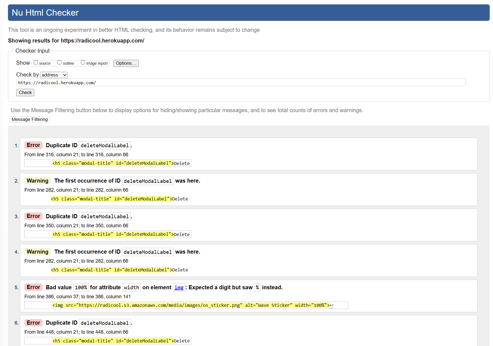</details>

**80 Total suggestions were returned. Using these results, I:**

- Refactored the deleteModal by moving it outside of Django if/or statements and deleting duplicates. Calling the modal from the HTML body rather than from within the statements.

- Placed modal at the top of the HTML body inline with [Bootstrap Document](https://getbootstrap.com/docs/4.0/components/modal/#:~:text=Whenever%20possible%2C%20place%20your%20modal,using%20modals%20on%20mobile%20devices.) guidance.

```

Modals use position: fixed, which can sometimes be a bit particular about its rendering. Whenever possible, place your modal HTML in a top-level position to avoid potential interference from other elements. You’ll likely run into issues when nesting a .modal within another fixed element.

```

- Removed redundant `Section` tags.

- Fixed Header hierarchy.

- Refactored `Featured Item` Cards to remove duplicate/redundant code.

- <details><summary>W3C HTML Validation - Home Pass</summary>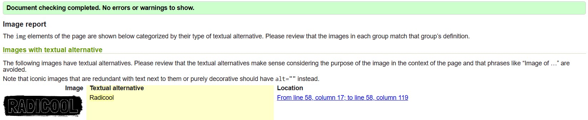</details>

- <details><summary>W3C HTML Validation - Products Pass</summary>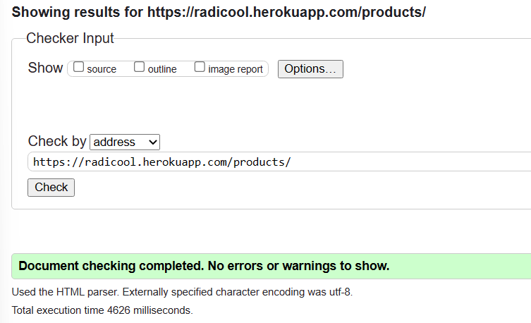</details>

- <details><summary>W3C HTML Validation - Checkout Pass</summary>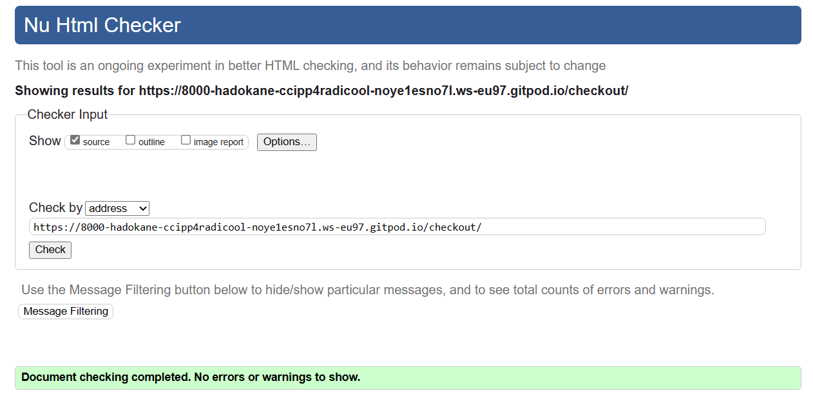</details>

---

## W3C CSS Validation

- [W3C CSS Jigsaw Validator](https://jigsaw.w3.org/css-validator/)

- <details><summary>W3C CSS Validation </summary>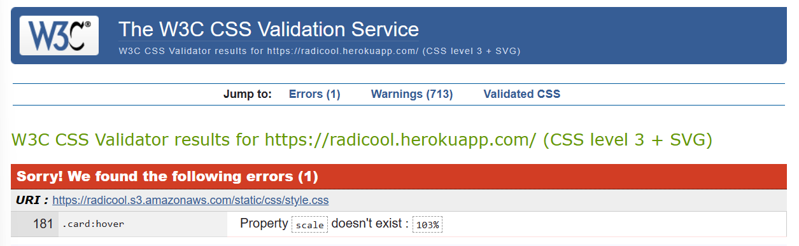</details>

**1 "Error" was returned.**

This error is a false flag, as proven by this article from [W3Schools](https://www.w3schools.com/cssref/css_pr_scale.php) explaining how to use the scale property and providing "%" as a valid input, also stating that:

```
Note: An alternative technique to scale an element is to use CSS transform property with CSS scale() function.
The CSS scale property, as explained on this webpage, is arguably a simpler and more direct way to scale an element.
```

[Mig281](https://github.com/validator/validator/issues/1091) in a GitHub discussion explains that the validator expects this instead:

```
#foo, .bar {
  transform: scale(0.8);
}

The MDN docs do state:
The scale CSS property allows you to specify scale transforms individually and independently of the transform property. This maps better to typical user interface usage, and saves having to remember the exact order of transform functions to specify in the transform value.
```

As shown here this is an issue with the validator not recognising this "newer" CSS property rather than an issue with my CSS code.

I am satisfied with the results of this validation and consider it to be passed, as I have used a more efficient method for my use-case than the suggested "fix".

---

## JSHINT Validation

- [JSHint Validator](https://jshint.com/)

I utilised JSHint as a validation tool for the "Checkout.JS" file. Which contains all of the projects internal JS used for Stripe and payment handling. The validator passed Radicool's JS.

  - <details><summary>JSHint Validation</summary>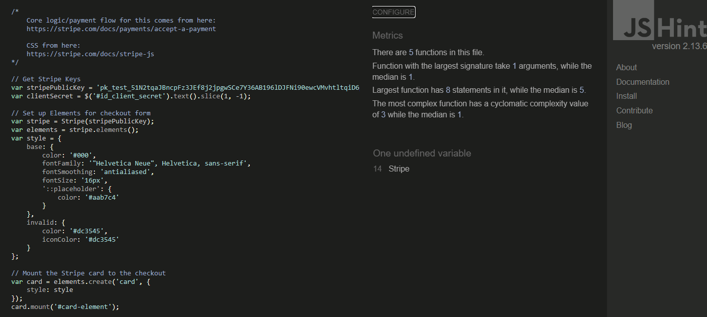</details>

---

## Flake8 Python Linter

- [Flake8 Validator](https://pep8ci.herokuapp.com/)

This was ran internally using GitPod's CLI.

Initially a number of formatting errors were shown:

  - <details><summary>Initial Python Lint</summary>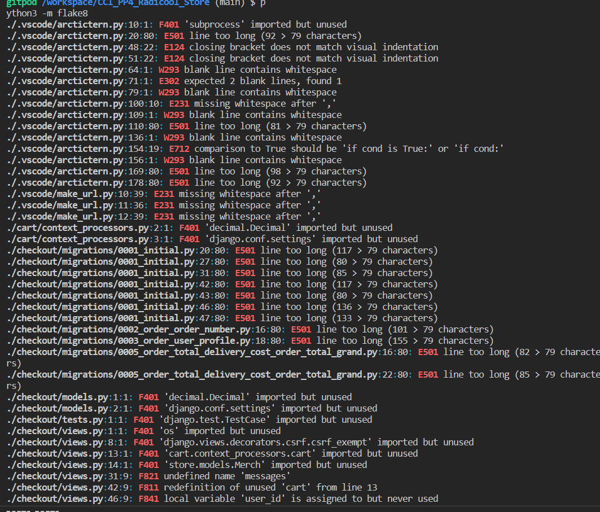</details>

Upon refactoring, Radicool passed the Python Linting process. 

  - <details><summary>Python Linting - Pass</summary>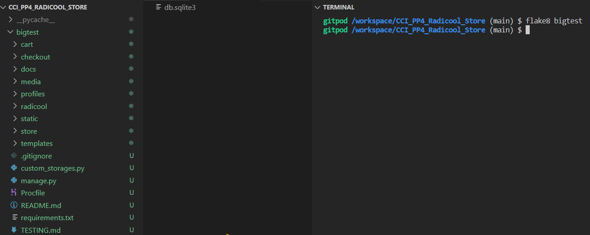</details>

The entire project was inserted into a file and checked. This was to avoid false flags from other frameworks or plugins beyond my control.

---

## Wave Validator

- [Wave Web Accessibility Evaluation Tool](https://wave.webaim.org/)

This was used to check the accessibility of Radicool in meeting individual user needs.

included in the navbar. Repeating adjacent links seemed unnecessary to Wave.

  - <details><summary>Wave Error #1</summary>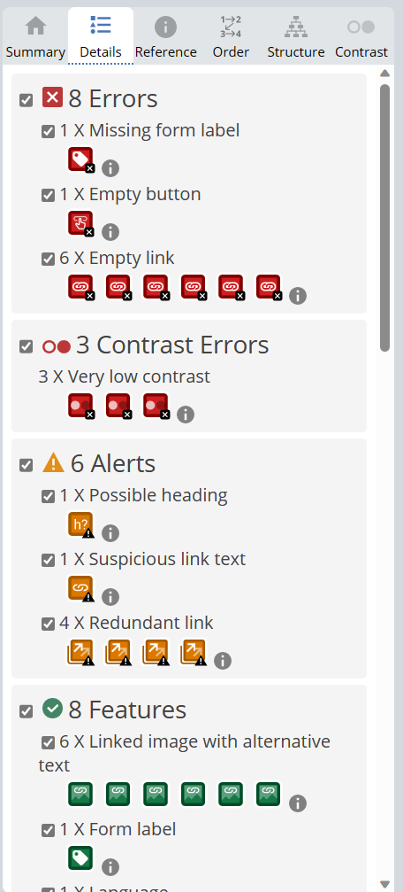</details>

Improvements-made:

- `sr-only` label added to `search_bar` for screen-reader use.

- `sr-only` span elements added inside of empty links that use icons as their context rather than text, such as the social links in the footer.

After carrying out the above steps, Radicool passed Wave validation.

  - <details><summary>Wave Validation Pass</summary>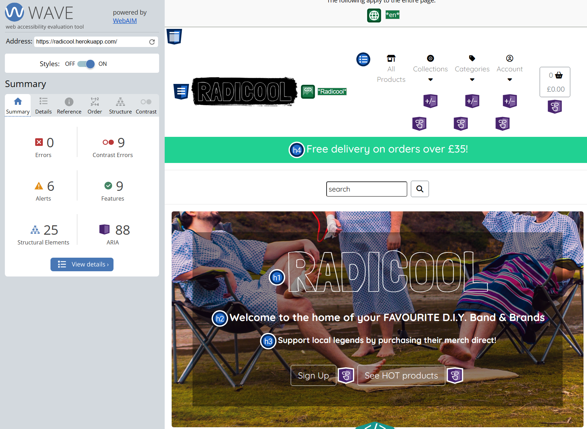</details>

As justification for the remaining contrast errors and alerts:

- Alerts are referring almost entirely to "redundant links" but I feel a user would expect multiple elements within the same card to lead to that cards `info` html page. As such these have been left in to provide a better user experience, as they cause no issues to the website.

- Contrast errors are all in reference to white text appearing on the Radicool green. This is a similar colour convention's used by world renowned brands such as: Subway, Asda, Starbucks and Xbox. I am confident users will have no issue interacting with these elements and have ensured it is only used on elements that are not-integral to a users purchase journey such as sort buttons and a website banner.

---

## Lighthouse

- [Google Chrome Lighthouse Validator](https://developer.chrome.com/docs/lighthouse/overview/)

Google Lighthouse was used to run performance, accessibility & SEO audits of Radicool.

<details><summary>Lighthouse Initial Check - Desktop</summary>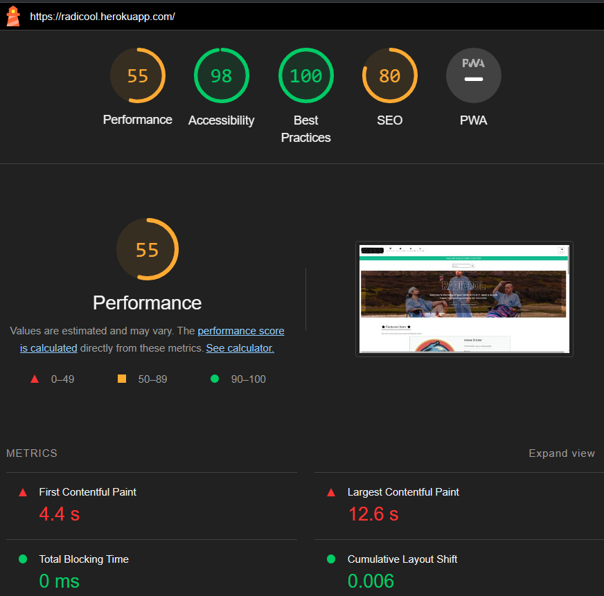</details>

The performance results were concerning, to improve this statistic and raise scores the following was done:

- `<Meta>` tags were added to the base template's head to improve the SEO potential of Radicool.

- Stripe JS was moved to the checkout page where it was required instead of being ran from the Base template.

- Replaced images within the Amazon Bucket. Changing .jpg's and .png's into .webp images using [Cloud Convert](https://cloudconvert.com/). Boosted "Home" Performance to 56%.

- Navbar links coloured darker and made bolder.

- Javascript moved to base template footer from head.

- Hero Image pre-loaded within the HTML.

After implementing all of the above changes there was only a marginal shift in my Performance score.

<details><summary>Lighthouse Desktop</summary>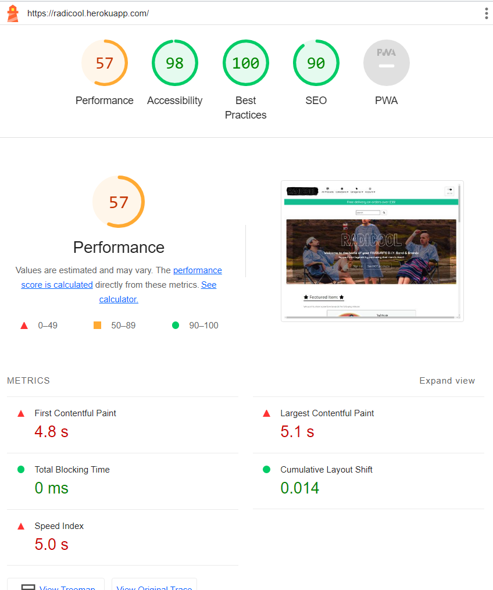</details>

<details><summary>Lighthouse Mobile</summary>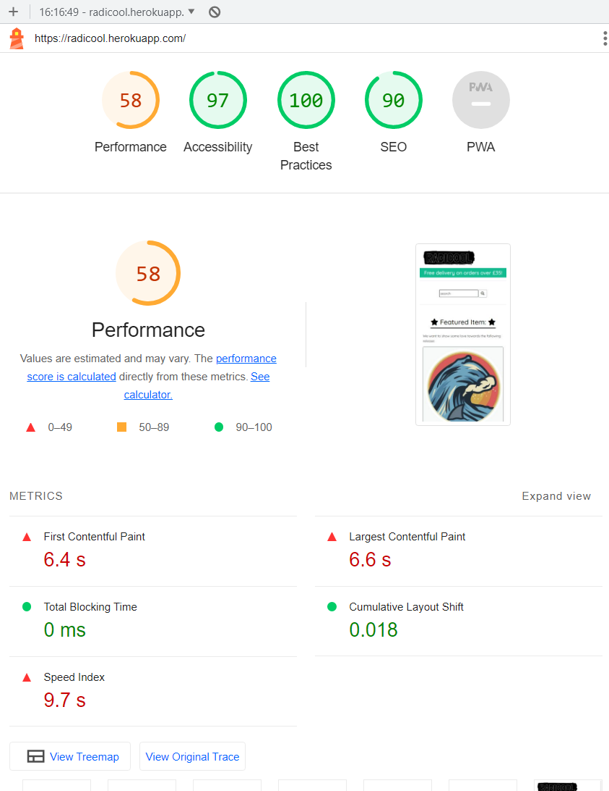</details>

Running a test on the same project locally instead gave these results.

<details><summary>Lighthouse Local Desktop Check</summary>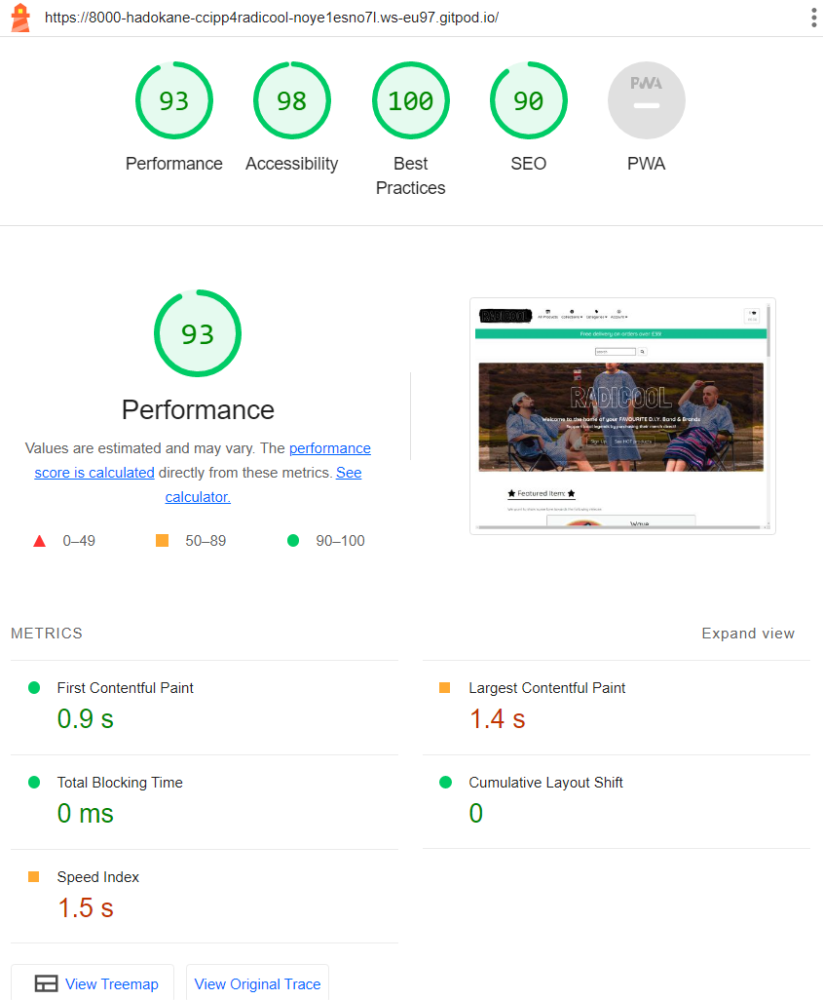</details>

With the above in mind I feel as though I've done what I can to improve the scores & that further improvements to "Performance" would require me to purchase and upgrade my subscriptions to either Heroku, Railway or - most likely - Amazon's services.

With that in mind, I am happy with the above results and feel this testing process has dramatically improved the overall speed and best practice across the Radicool E-commerce store. Images have been drastically condensed in file-size, the order of elements and frameworks loading has been improved and sped-up.

All-in-all a better user-experience has been achieved. 

[Back to Top ↑](#testing-document)

---

# Device Testing

The website was tested and functioned as expected on the following devices:

- Novatech LTD. AMD Ryzen 7 3800x, 32GB Desktop
- Lenovo IdeaPad 5 Pro
- Samsung Galaxy S20 & S21
- Samsung Galaxy Tab S7
- MacBook Air with M1 chip
- iPhone 11, 13 & 14
- iPad Air
- Samsung Chrome Book

The website has been tested on up-to-date versions of the following browsers:

- Microsoft Edge
- Google Chrome
- Chrome for android
- Mozilla Firefox
- Opera
- Safari
- Internet Explorer
- Duck Duck Go

The website has also been tested on monitors of 16:9, 16:10 and 21:9 resolutions.

[Back to Top ↑](#testing-document)
