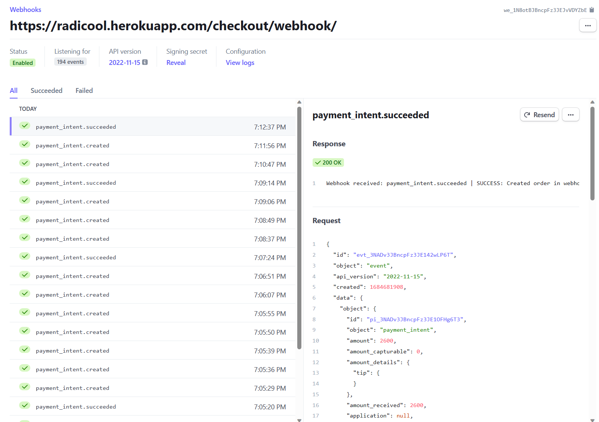
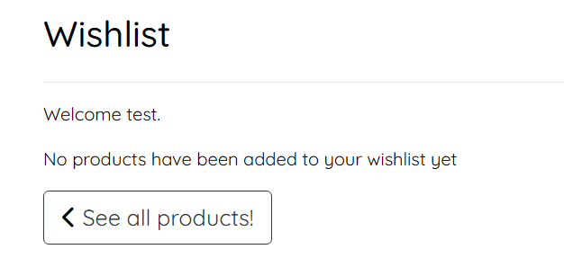
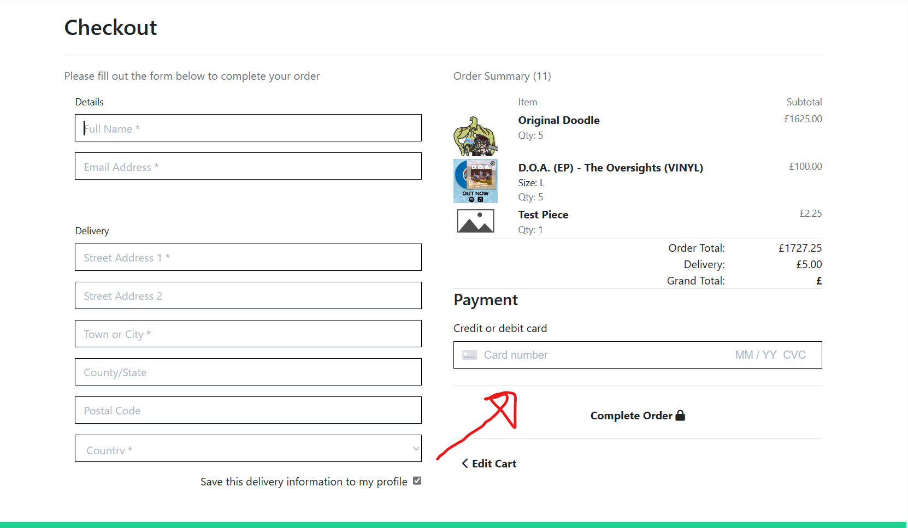

# Testing

Here we will document the numerous testing and validation methods taken to ensure Radicool functions as intended while providing a positive, accessible user experience:

---

## Contents

---

- [Code Validation](#code-validation)
  - [W3C HTML Validator](#w3c-html-validation) 
  - [W3C CSS Validator](#w3c-css-validation)
  - [JSHint Validator](#jshint-validation)
  - [Flake8 Linter](#flake8-python-linter)
  - [Wave Validator](#wave)
  - [Lighthouse](#lighthouse)
- [Testing User Stories](#testing-user-stories)
  - [First Time User](#first-time-user)
  - [Returning User](#returning-user)
  - [Website Owner](#website-owner)
- [Bugs](#bugs)

Return to [README.md ↑](/README.md#testing)

---

# Code Validation

This section will cover the automated testing procedures undertaken and justifies design decisions made during the creative processes undertaken.

---

## W3C HTML Validation

---

-  [W3C HTML Validator](https://validator.w3.org/)

  - <details><summary>W3C HTML Validation - Errors</summary></details>

**80 Total suggestions were returned. Using these results, I:**

- Refactored the deleteModal by moving it outside of Django if/or statements and deleting duplicates. Calling the modal from the HTML body rather than from within the statements.

- Placed modal at the top of the HTML body inline with [Bootstrap Document](https://getbootstrap.com/docs/4.0/components/modal/#:~:text=Whenever%20possible%2C%20place%20your%20modal,using%20modals%20on%20mobile%20devices.) guidance.

```

Modals use position: fixed, which can sometimes be a bit particular about its rendering. Whenever possible, place your modal HTML in a top-level position to avoid potential interference from other elements. You’ll likely run into issues when nesting a .modal within another fixed element.

```

- Removed redundant `Section` tags.

- Fixed Header hierarchy.

- Refactored `Featured Item` Cards to remove duplicate/redundant code.

- <details><summary>W3C HTML Validation - Home Pass</summary></details>

- <details><summary>W3C HTML Validation - Products Pass</summary></details>

- <details><summary>W3C HTML Validation - Checkout Pass</summary></details>

---

## W3C CSS Validation

- [W3C CSS Jigsaw Validator](https://jigsaw.w3.org/css-validator/)

- <details><summary>W3C CSS Validation </summary></details>

**1 "Error" was returned.**

This error is a false flag, as proven by this article from [W3Schools](https://www.w3schools.com/cssref/css_pr_scale.php) explaining how to use the scale property and providing "%" as a valid input, also stating that:

```
Note: An alternative technique to scale an element is to use CSS transform property with CSS scale() function.
The CSS scale property, as explained on this webpage, is arguably a simpler and more direct way to scale an element.
```

[Mig281](https://github.com/validator/validator/issues/1091) in a GitHub discussion explains that the validator expects this instead:

```
#foo, .bar {
  transform: scale(0.8);
}

The MDN docs do state:
The scale CSS property allows you to specify scale transforms individually and independently of the transform property. This maps better to typical user interface usage, and saves having to remember the exact order of transform functions to specify in the transform value.
```

As shown here this is an issue with the validator not recognising this "newer" CSS property rather than an issue with my CSS code.

I am satisfied with the results of this validation and consider it to be passed, as I have used a more efficient method for my use-case than the suggested "fix".

---

## JSHINT Validation

- [JSHint Validator](https://jshint.com/)

I utilised JSHint as a validation tool for the "Checkout.JS" file. Which contains all of the projects internal JS used for Stripe and payment handling. The validator passed Radicool's JS.

  - <details><summary>JSHint Validation</summary></details>

---

## Flake8 Python Linter

- [Flake8 Validator](https://pep8ci.herokuapp.com/)

This was ran internally using GitPod's CLI.

Initially a number of formatting errors were shown:

  - <details><summary>Initial Python Lint</summary></details>

Upon refactoring, Radicool passed the Python Linting process. 

  - <details><summary>Python Linting - Pass</summary></details>

The entire project was inserted into a file and checked. This was to avoid false flags from other frameworks or plugins beyond my control.

---

## Wave Validator

- [Wave Web Accessibility Evaluation Tool](https://wave.webaim.org/)

This was used to check the accessibility of Radicool in meeting individual user needs.

included in the navbar. Repeating adjacent links seemed unnecessary to Wave.

  - <details><summary>Wave Error #1</summary></details>

Improvements-made:

- `sr-only` label added to `search_bar` for screen-reader use.

- `sr-only` span elements added inside of empty links that use icons as their context rather than text, such as the social links in the footer.

After carrying out the above steps, Radicool passed Wave validation.

  - <details><summary>Wave Validation Pass</summary></details>

As justification for the remaining contrast errors and alerts:

- Alerts are referring almost entirely to "redundant links" but I feel a user would expect multiple elements within the same card to lead to that cards `info` html page. As such these have been left in to provide a better user experience, as they cause no issues to the website.

- Contrast errors are all in reference to white text appearing on the Radicool green. This is a similar colour convention's used by world renowned brands such as: Subway, Asda, Starbucks and Xbox. I am confident users will have no issue interacting with these elements and have ensured it is only used on elements that are not-integral to a users purchase journey such as sort buttons and a website banner.

---

## Lighthouse

- [Google Chrome Lighthouse Validator](https://developer.chrome.com/docs/lighthouse/overview/)

Google Lighthouse was used to run performance, accessibility & SEO audits of Radicool.

<details><summary>Lighthouse Initial Check - Desktop</summary></details>

The performance results were concerning, to improve this statistic and raise scores the following was done:

- `<Meta>` tags were added to the base template's head to improve the SEO potential of Radicool.

- Stripe JS was moved to the checkout page where it was required instead of being ran from the Base template.

- Replaced images within the Amazon Bucket. Changing .jpg's and .png's into .webp images using [Cloud Convert](https://cloudconvert.com/). Boosted "Home" Performance to 56%.

- Navbar links coloured darker and made bolder.

- Javascript moved to base template footer from head.

- Hero Image pre-loaded within the HTML.

After implementing all of the above changes there was only a marginal shift in my Performance score.

<details><summary>Lighthouse Desktop</summary></details>

<details><summary>Lighthouse Mobile</summary></details>

Running a test on the same project locally instead gave these results.

<details><summary>Lighthouse Local Desktop Check</summary></details>

With the above in mind I feel as though I've done what I can to improve the scores & that further improvements to "Performance" would require me to purchase and upgrade my subscriptions to either Heroku, Railway or - most likely - Amazon's services.

With that in mind, I am happy with the above results and feel this testing process has dramatically improved the overall speed and best practice across the Radicool E-commerce store. Images have been drastically condensed in file-size, the order of elements and frameworks loading has been improved and sped-up.

All-in-all a better user-experience has been achieved. 

[Back to Top ↑](#testing-document)

---

# Device Testing

The website was tested and functioned as expected on the following devices:

- Novatech LTD. AMD Ryzen 7 3800x, 32GB Desktop
- Lenovo IdeaPad 5 Pro
- Samsung Galaxy S20 & S21
- Samsung Galaxy Tab S7
- MacBook Air with M1 chip
- iPhone 11, 13 & 14
- iPad Air
- Samsung Chrome Book

The website has been tested on up-to-date versions of the following browsers:

- Microsoft Edge
- Google Chrome
- Chrome for android
- Mozilla Firefox
- Opera
- Safari
- Internet Explorer
- Duck Duck Go

The website has also been tested on monitors of 16:9, 16:10 and 21:9 resolutions.

[Back to Top ↑](#testing-document)

---

# Manual Testing

Manual testing played a crucial role in the development of this  project.

It has been carried out at each step of development through the use of Chrome Dev Tools, family & friends user tests and by asking and solving questions about the sites functionality in order to find any additional development oversights.

Once the project had reached its developmental conclusion I compiled a list of main concerns that would need to be passed to confirm the site worked as intended. Through this methodology, I can ensure that I've satisfied my project brief and provided a fully functional full-stack website, fit for consumption by multiple users.

---

1. Can users create a new account?

Here we created a new user account with a test email from [Temp Mail](https://temp-mail.org/en/) and attempt to sign up to Radicool.

**Passes Testing:**

- A user is warned of incorrect or insecure data when signing up through Django AllAuth & Alert messages.

- The user is sent an email allowing them to authenticate their account.

- Once authenticated a user is able to sign in to their account.

- This is a responsive, positive user experience, with informative prompts and interactive elements to guide the user.

<details><summary>Sign Up - Quality check</summary></details>

<details><summary>Sign Up - Test</summary></details>

<details><summary>Sign Up - Email Verification Required</summary></details>

<details><summary>Sign Up - Email Received</summary></details>

<details><summary>Sign Up - Email Confirmation</summary></details>

<details><summary>Sign Up - Email Verified</summary></details>

---

2. Can users login on their verified accounts?

**Passes Testing:** Alerts tell the user of issues preventing login. The user is able to login to the website with the correct information.

<details><summary>Login - Test</summary></details>

<details><summary>Login - Warning</summary></details>

<details><summary>Login - Success</summary></details>

---

3. Does a "Brand Account" user have C.R.U.D. functionality from the Front-End?

For this test:

- The user "Test" was given a "Brand Account" group class within Django Admin.

- The user "Test2" serves as a standard user account.

**Passes Testing:** 

- The Brand Account user is able to access a limited version of the Admin section from the Front-End. Viewing order history and having C.R.U.D. functionality over Merchandise.

- They can perform C.R.U.D. functionality from the Front-End via the "Add" & "Edit" pages.

- They are able to Delete products from the Front-End via a defensively designed delete modal.

- Regular users are blocked from accessing Brand Account only pages if they navigate to the URL directly and are informed of this by Alerts.

<details><summary>Brand Account - Assigning group</summary></details>

<details><summary>Brand Account - Brand footer</summary></details>

<details><summary>Brand Account - Navbar</summary></details>

<details><summary>Brand Account - Card footer</summary></details>

<details><summary>Brand Account - Add Page</summary></details>

<details><summary>Brand Account - Edit Page</summary></details>

<details><summary>Brand Account - Delete Page</summary></details>

<details><summary>Brand Account - Admin</summary></details>

<details><summary>Standard User - Sign in & Navbar</summary></details>

<details><summary>Standard User - Redirect Message</summary></details>

---

4. Can users add items to their cart?

**Passes Testing:** 

- Users are able to add items to their cart and this is reflected by the live updating cart in the top right of the site.

- The cart functions as expected by updating it's subtotal and quantity.

- Button text provides live positive feedback.

<details><summary>Cart - Add Test</summary></details>

<details><summary>Cart - Added</summary></details>

---

5. Can users edit items within their cart?

**Passes Testing:** 

- Users are able to remove items from the cart via interactive buttons.

- The totals dynamically update to inform the user of shipping costs, sub totals for each item and the carts grand total.

- Size and quantity can be updated for each item dynamically within the cart.

- Button text provides live positive feedback for update. Page refreshes on removal.

<details><summary>Cart - Test</summary></details>

<details><summary>Cart - Remove</summary></details>

<details><summary>Cart - Update</summary></details>

<details><summary>Cart - Updated</summary></details>


---

6. Can users checkout and complete a purchase?

**Passes Testing:** 

- The user can enter and save their information to their profile.

- Stripe payment is accepted.

- Stripe Webhooks are received.

- The user is shown a confirmation page.

- The order appears within the users Profile under Order History and is viewable.

- A confirmation email is sent to the user.

- Users can save delivery information in their Profile, that is then called in the Checkout.

<details><summary>Checkout - Test</summary></details>

<details><summary>Checkout - Info Entered</summary></details>

<details><summary>Checkout - Confirmed</summary></details>

<details><summary>Checkout - Email Received</summary></details>

<details><summary>Checkout - Email Contents</summary></details>

<details><summary>Checkout - Order History</summary></details>

<details><summary>Profile - Past Order</summary></details>

<details><summary>Profile Info - Test</summary></details>

<details><summary>Profile Saved</summary></details>

<details><summary>Checkout - Calls Profile Info</summary></details>

<details><summary>Stripe- Success</summary></details>

---

7. Can users use their Wish List?

**Passes Testing:** 

- The user is able to add & remove items from their wish list.

- The correct buttons display by items to show the user if they are within their list or not.

- Merchandise on the wish list page link correctly to their `info` pages when interacted with.

- The user has front-end C.R.U.D. functionality over their wish list.

- Unauthorised users are directed to the sign up page, thus being incentivised to sign up for Radicool's services.

- Toast Alerts provide positive feedback for users.

<details><summary>Wish List - Empty</summary></details>

<details><summary>Wish List - Add</summary></details>

<details><summary>Wish List - Add Alert</summary></details>

<details><summary>Wish List</summary></details>

<details><summary>Wish List - Remove</summary></details>

<details><summary>Wish List - Saved between sessions, browsers and devices.</summary></details>

---

8. Can Guests checkout?

**Passes Testing:** 

- Guests are able to checkout and receive confirmation emails the same as regular users.

<details><summary>Checkout - Guest</summary></details>

<details><summary>Checkout - Guest Email Received</summary></details>

<details><summary>Checkout - Guest Email</summary></details>

---

**Additional Tests:** 

- Users are able to sign in on multiple devices.

- Alert Toasts can be closed by clicking them.

- Users cannot see other users' data.

[Back to top ↑](#testing_document)

---

# Testing User Stories

Here we will test our previously defined user goals by providing and acknowledging evidence that shows they are met by the current deployed project.

---

## First-time User

**As a First-Time user, I want to:**

| ID      | GOAL          | GOAL MET? (X=MET)      |
| -------------|:-------------:|:-------------:|
| A1           | Browse Merch on the website          | X |
| A2           | Search for Merchandise directly      | X |
| A3           | Add items to Cart   | X |
| A4           | View my Cart     | X |
| A5           | Edit my Cart    | X |
| A6           | Checkout as Guest    | X |
| A7           | Receive Order Confirmations  | X |
| A8           | Have a reason to sign up | X |
| A9           | Create an account | X |
| A10          | Access the site on different devices | X |

- A1 is met by the Products, Categories & Collections pages.
- A2 is met by the above & the search bar function.
- A3-A5 is met by the Cart section and proven in earlier testing.
- A6-A7, A9 & A10 are proven in the above Manual Testing section.
- A8 is met by the website featuring the Wish List & Profile section of the website.

---

## Returning User

**As a Returning user, I want to:**

| ID      | GOAL          | GOAL MET? (X=MET)      |
| -------------|:-------------:|:-------------:|
| B1           | Login to my account          | X |
| B2           | Save my Cart between sessions     | X |
| B3           | Save my information for faster purchases  | X |
| B4           | View my Order History    | X |
| B5           | Save items to a Wish List    | X |

- B1-B5 are all met and proven in the above Testing section.
- B2 the Cart is saved in the user's session remaining on the same device and browser.
- The Wish List & Order History is saved across all devices.

---

## Brand User

**As a Brand user, I want to:**

| ID      | GOAL          | GOAL MET? (X=MET)      |
| -------------|:-------------:|:-------------:|
| C1           | Add items to the store          | X |
| C2           | Add Categories & Collections    | X |
| C3           | View Users' Order History  | X |
| C4           | Update items within the store    | X |
| C5           | Remove items from the store    | X |

- C1-C5 are all met and proven in the above Testing section.
- Functionality is provided on the Front-End through the `Add` & `Edit` pages.
- They are able to view users order history within their Admin section.

---

## Site Admin

**As the Site Admin, I want to:**

| ID      | GOAL          | GOAL MET? (X=MET)      |
| -------------|:-------------:|:-------------:|
| D1           | Have the same C.R.U.D. functionality as Brands | X |
| D2           | View & manage User Accounts    | X |
| D3           | View & manage Orders  | X |
| D4           | Receive Stripe payments   | X |
| D5           | Ensure site users have their expected experiences  | X |

- D1 & D5 are met by the above section goals being met.
- D2 & D3 are achievable through Django's Admin pages.
- D4 is proven in the above Manual Testing section.

After carrying out the above Testing - both Manual & Automated - I have substantial reason to declare all User Goals met.

[Back to top ↑](#testing_document)

---

# Bugs

Over the course of this project, I encountered numerous bugs that needed to be fixed and overcome.

In the following section I will document each of these and the methods used to correct their related issues.

## Chrome Dev Tools

Chrome Dev Tools served as an important tool when debugging. 

It allowed me to find numerous errors in the code such as out of place closing tags, view and correct console errors and try out numerous in-line styles while finding specific classes that could be changed with CSS. It was a crucial tool used to detect and diagnose bugs.

---

### BUG #1

---

**Bug:** /admin/login does not exist.

<details><summary>Bug 1</summary></details>

**Fix:** Needed to define SITE_ID=1 in settings.py.

<details><summary>Bug 1 - Fix</summary></details>

- Solution found here: [Stack Overflow](https://stackoverflow.com/questions/9736975/django-admin-doesnotexist-at-admin)

---

### BUG #2

---

**Bug:** CSRF Verification failed.

<details><summary>Bug 2</summary></details>

**Fix:** Added the below to setting file:
```
CSRF_TRUSTED_ORIGINS = [
  'https://8000-hadokane-ccipp4radicool-noye1esno7l.ws-eu96.gitpod.io'
]
```

- Solution found here: [Stack Overflow](https://stackoverflow.com/questions/10388033/csrf-verification-failed-request-aborted)

---

### BUG #3

---

**Bug:** no such table: store_category

<details><summary>Bug 3</summary></details>

**Fix:** The solution was to flush the migrations folder from the Store App & re-migrate the tables.

- Solution found here: [Stack Overflow](https://stackoverflow.com/questions/43880426/how-to-force-migrations-to-a-db-if-some-tables-already-exist-in-django)

---

### BUG #4

---

**Bug:** I limited the `max_digits` on the `Merch` tables `price` field too much. Not realising it included decimal places.

<details><summary>Bug 4</summary></details>

**Fix:** Increasing `max_digits=8` allowing for higher prices in the store.

<details><summary>Bug 4 - Fix</summary></details>

---

### BUG #5

---

**Bug:** Images not showing when called from the Media folder.

<details><summary>Bug 5</summary></details>

<details><summary>Bug 5 - Code</summary></details>

**Fix:** Needed to include `Media` before the URL, 

I discovered this issue by printing the link out to the page and seeing it wasn't parsing the full url. Print(m.image)

<details><summary>Bug 5 - Fix</summary></details>

---

### BUG #6

---

**Bug:** Images showing on `Home` but not on `item`.

<details><summary>Bug 6</summary></details>

Realised similar to the above bug, `item` is being added to the URL making the image link incorrect.

<details><summary>Bug 6 - URL</summary></details>

**Fix:** Added ../media/ to the beginning of the URL, this fixed the issue.

<details><summary>Bug 6 - Code Fix</summary></details>

<details><summary>Bug 6 - Fix</summary></details>

Note - Later this was updated further to: `{{ merch.image.url }}` which was crucial for linking the project to external databases.

---

### BUG #7

---

**Bug:** The page is showing it's HTML code in the page body rather than expected page content.

<details><summary>Bug 7 - Body</summary></details>

Dev Tools revealed the page's HTML was being loaded as text into the body for some reason.

<details><summary>Bug 7 - Dev Tools</summary></details>

**Fix:** Appeared to be an issue with having multiple dictionaries in a return, condensing them fixed the issue.

```
ISSUE CODE:

return render(request, "store/merch/collection.html", {"collection": collection}, {"merch": merch})

FIXED CODE:
return render(request, "store/merch/collection.html", {"collection": collection, "merch": merch})
```

---

### BUG #8

---

**Bug:** When selected a Category or Collection `item` was being added to the URL, causing an error.

<details><summary>Bug 8</summary></details>

**Fix:** Wrong `reverse` URLs were used on the Models. Correcting these to the below code fixed the issue.

<details><summary>Bug 8 - Incorrect Code</summary></details>

```
FIXED CODE:

def get_absolute_url(self):
    return reverse("store:category_info", args=[self.slug])

def get_absolute_url(self):
    return reverse("store:collection_info", args=[self.slug])

```

---

### BUG #9

---

**Bug:** `Reverse` for `Store` app not found.

<details><summary>Bug 9</summary></details>

**Fix:** The original URL's mentioned in Code Institute tutorials were shown as:

```
EXAMPLE:


CODE USED:

```
This returned errors, the solution was to use updated syntax and provide the app's name first:
```
EXAMPLE:


FIX:

```

<details><summary>Bug 9 - Fix</summary></details>

- Solution found here: [Stack Overflow](https://stackoverflow.com/questions/45724006/django-reverse-for-not-found-is-not-a-valid-view-function-or-pattern-na)

---

### BUG #10

---

**Bug:** `Size` showing for all items in Cart if anything is updated.

<details><summary>Bug 10</summary></details>

The following Code introduced this issue.

<details><summary>Bug 10 - Code</summary></details>

**Fix:** Used the following code to target specific elements and change them on user click.

<details><summary>Bug 10 - Code Fix</summary></details>

<details><summary>Bug 10 - Fix</summary></details>

---

### BUG #11

---

**Bug:** Only Merchandise with a `Size` would update in the Cart.

<details><summary>Bug 11</summary></details>

<details><summary>Bug 11 - No Update</summary></details>

Items without sizes weren't updating due to this line of code stopping later code from running.

<details><summary>Bug 11 - Error Code</summary></details>

**Fix:** I updated the below code:

<details><summary>Bug 11 - Initial Code</summary></details>

To this, calling an if function to only get the element when `Size` met a set parameter:

<details><summary>Bug 11 - Fix</summary></details>

---

### BUG #12

---

**Bug:** Stripe Checkout Form not submitting.

<details><summary>Bug 12</summary></details>

**Fix:** The Submit button was'nt inside the form tags. Moving it inside fixed the issue.

---

### BUG #13

---

**Bug:** Stripe Webhooks all failing. None returning to local project.

<details><summary>Bug 13</summary></details>

**Fix:** Initially I used Stripe's Local Listener which began returning positive webhooks.

<details><summary>Bug 13 - Local Fix</summary></details>

I later realised that setting the local server to `Public` within GitPod would fix this issue.

<details><summary>Bug 13 - Public Fix</summary></details>

<details><summary>Bug 13 - Stripe</summary></details>

---

### BUG #14

---

**Bug:** Custom templates not being detected by Django AllAuth.

<details><summary>Bug 14</summary></details>

**Fix:** Corrected AllAuth templates URL within Radicool.settings.

<details><summary>Bug 14 - Fix</summary></details>

---

### BUG #15

---

**Bug:** Items without `Size` show `None` within the Admin database. This is too long for the two characters expected such as "XS" or "XL" by the `Size` field.

<details><summary>Bug 15</summary></details>

<details><summary>Bug 15 - Code</summary></details>

**Fix:** Changed the code within `Size` on the data model, increasing the `max_length` from "2" to "4".

---

### BUG #16

---

**Bug:** The Button & Link were changing colours seperately on `:hover`, causing a slight delay before both reached the same colouration.

<details><summary>Bug 16</summary></details>

**Fix:** Remove the surrounding button and style the `a` class to appear as the button. Fixed the issue on user `:hover`.

<details><summary>Bug 16 - Fix</summary></details>

---

### BUG #17

---

**Bug:** No Wish List heart icon showing for newly created users or unauthorised users.

<details><summary>Bug 17</summary></details>

**Fix:** Added additional if/else tags to the template HTML. Providing a view for unauthorised viewers and a view for users who were authenticated but had no Wish List, as the Wish List wouldn't be created for a user if it was empty, preventing users from adding to an empty Wish List.

<details><summary>Bug 17 - Fix</summary></details>

---

### BUG #8

---

**Bug:** Deployment issue prevented Heroku build.

<details><summary>Bug 1</summary></details>

**Fix:** Downgrading the projects requirement version `backports` fixed the issue.

```
backports.zoneinfo==0.2.1;python_version<"3.9"
```

---

### BUG #8

---

**Bug:** Issue here

<details><summary>Bug 1</summary></details>

**Fix:** Fix here

<details><summary>Bug 1 - Fix</summary></details>

---

### BUG #8

---

**Bug:** Issue here

<details><summary>Bug 1</summary></details>

**Fix:** Fix here

<details><summary>Bug 1 - Fix</summary></details>

---

### BUG #8

---

**Bug:** Issue here

<details><summary>Bug 1</summary></details>

**Fix:** Fix here

<details><summary>Bug 1 - Fix</summary></details>

---

### BUG #8

---

**Bug:** Issue here

<details><summary>Bug 1</summary></details>

**Fix:** Fix here

<details><summary>Bug 1 - Fix</summary></details>

---

### BUG #8

---

**Bug:** Issue here

<details><summary>Bug 1</summary></details>

**Fix:** Fix here

<details><summary>Bug 1 - Fix</summary></details>

---

### BUG #8

---

**Bug:** Issue here

<details><summary>Bug 1</summary></details>

**Fix:** Fix here

<details><summary>Bug 1 - Fix</summary></details>

- Solution found here: [Stack Overflow](https://stackoverflow.com/questions/71712258/error-could-not-build-wheels-for-backports-zoneinfo-which-is-required-to-insta)

---

## Known Bugs

---

If a User refreshes the Order Confirmation page it will resend the Confirmation email.

This is a minor issue that would only effect a very small subset of users, that happen to refresh their order confirmations.

A warning has been added to the bottom of Confirmation Emails to inform the user that if they receive multiple emails with the same order number, that they haven't been billed more than once.

This is a satisfactory - yet temporary - solution and something I would look to improve upon in future builds of this project.

[Back to Top ↑](#testing-document)

[Return to README.md ↑](/README.md#testing)